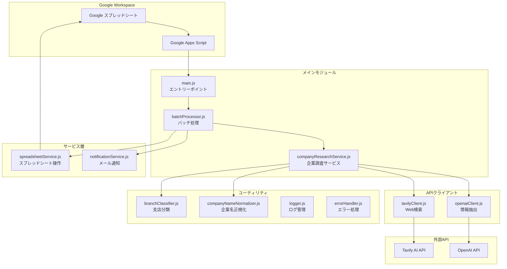
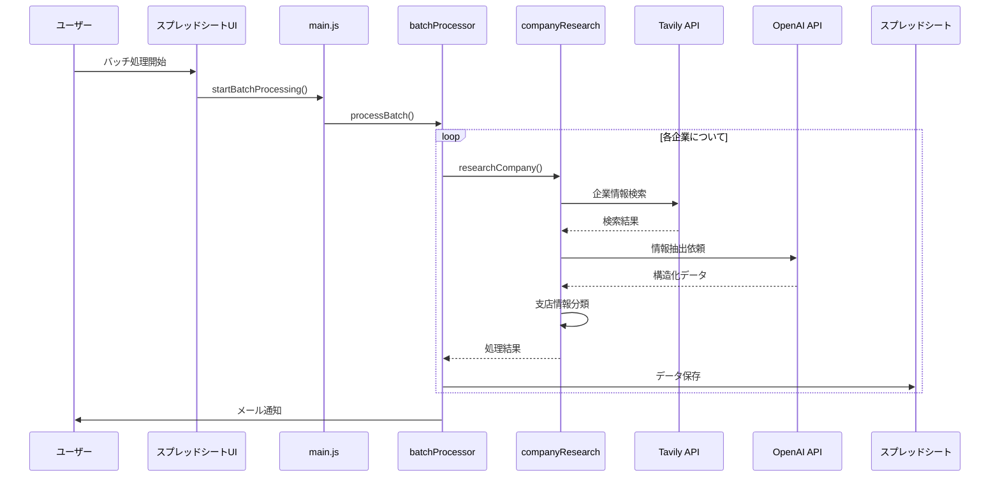

# 企業情報収集システム (Corporate Research System)

## 概要
このシステムは、日本企業の情報をWeb検索とAIを活用して自動的に収集・整理し、Google スプレッドシートに保存するGoogle Apps Script (GAS) ベースのアプリケーションです。

## 主な機能
- 🔍 **企業情報の自動収集**: Tavily AI を使用したWeb検索
- 🤖 **AI による情報抽出**: OpenAI GPT-4 による構造化データ抽出
- 📊 **スプレッドシート連携**: 本社・支店情報の自動保存
- 🏢 **支店情報の詳細抽出**: 住所、電話番号、従業員数、営業時間など
- 📧 **バッチ処理とメール通知**: 複数企業の一括処理

## システム構成図



## データフロー図



## ディレクトリ構造

```
corporate_research/
├── README.md                 # メインドキュメント
├── package.json             # 依存関係管理
├── docs/                    # ドキュメント
│   ├── REQUIREMENTS.md      # 要件定義書
│   ├── ARCHITECTURE.md      # アーキテクチャ設計書
│   └── setup.md            # セットアップガイド
└── src/                     # ソースコード（Google Apps Scriptにプッシュされる）
    ├── appsscript.json      # GAS設定
    ├── core/                # コアモジュール
    │   ├── Constants.js     # 定数定義
    │   ├── Logger.js        # ログ管理
    │   ├── ConfigManager.js # 設定管理
    │   └── ErrorHandler.js  # エラー処理
    ├── api/                 # API層
    │   ├── ApiBase.js       # API基底クラス
    │   ├── TavilyClient.js  # Tavily API クライアント
    │   └── OpenAIClient.js  # OpenAI API クライアント
    ├── models/              # データモデル
    │   └── Company.js       # 企業データモデル
    ├── research/            # 企業調査機能
    │   ├── CompanyResearchService.js # 企業調査サービス
    │   └── BatchProcessor.js         # バッチ処理
    ├── spreadsheet/         # スプレッドシート連携
    │   └── SpreadsheetService.js # スプレッドシート操作
    ├── main/                # メイン機能
    │   ├── Main.js          # エントリーポイント
    │   └── TriggerManager.js # トリガー管理
    ├── setup/               # セットアップ機能
    │   ├── SetupGuide.js    # 統合セットアップガイド
    │   └── system_setup.js  # セットアップスクリプト
    ├── tests/               # テスト
    │   └── SystemTest.js    # システムテスト
    └── utils/               # ユーティリティ（今後拡張予定）

```

## 📊 出力データ形式

### 本社情報シート
| 列名 | 説明 |
|------|------|
| 企業ID | 一意識別子 |
| 企業名 | 企業名 |
| 正式企業名 | 正式名称 |
| 電話番号 | 本社電話番号 |
| 業種大分類/中分類 | 業種情報 |
| 従業員数 | 従業員数 |
| 設立年 | 設立年 |
| 資本金 | 資本金 |
| 本社住所 | 郵便番号、都道府県、市区町村、詳細 |
| 代表者名/役職 | 代表者情報 |
| 企業理念 | 企業理念・ミッション |
| 最新ニュース | 最新情報 |
| 採用状況 | 採用情報 |
| 企業URL | 公式サイト |
| 信頼性スコア | データの信頼性（0-100） |

### 支店情報シート
| 列名 | 説明 |
|------|------|
| 企業ID | 本社との紐付け |
| 支店名 | 支店・営業所名 |
| 支店電話番号 | 電話番号 |
| 支店住所 | 郵便番号、都道府県、市区町村、詳細 |
| 支店種別 | 支社/支店/営業所/工場等 |
| 主要度ランク | 重要度（1-5） |
| 従業員数 | 支店の従業員数 |
| 営業時間 | 営業時間 |
| 備考 | その他情報 |

## 主要コンポーネントの説明

### 1. CompanyResearchService
企業情報調査の中核となるサービス。以下の処理を実行：
- Web検索クエリの最適化
- 中小企業向け特別検索
- OpenAIによる情報抽出
- 支店情報の分類と整理

### 2. TavilyClient
Tavily AI APIを使用したWeb検索クライアント：
- 日本語企業情報に最適化
- 複数の検索戦略（基本、詳細、フォールバック）
- 検索結果の品質評価

### 3. OpenAIClient
GPT-4を使用した情報抽出：
- 構造化されたJSONスキーマに基づく抽出
- 支店情報の詳細な抽出指示
- 住所、電話番号、営業時間などの正確な抽出

### 4. BranchClassifier
本社・支店の分類ユーティリティ：
- キーワードベースの分類
- 住所情報からの拠点タイプ判定
- 重要度ランクの自動計算

## 🧪 テスト実行ガイド

### テスト階層の概要
本システムには4段階のテスト階層が実装されています：

| テスト種別 | 目的 | 実行環境 | 所要時間 |
|------------|------|----------|----------|
| **🔧 単体テスト** | 各モジュールの個別機能検証 | モック環境 | ~30ms |
| **🔗 統合テスト** | 複数サービス間の連携検証 | モック環境 | ~10ms |
| **🌐 E2Eテスト** | 完全ワークフローの動作検証 | モック環境 | ~150ms |
| **🚀 本番環境テスト** | 実際のAPI・データでの動作検証 | 本番環境 | 数分 |

---

## 📋 1. 開発環境テスト（モック使用）

### 基本テスト実行

Google Apps Scriptエディタで以下の関数を実行：

**📁 実行ファイル**: `src/tests/framework/TestRunner.js`

```javascript
// 🎯 推奨：全テストの実行
runAllTests();           // TestRunner.js の関数

// 個別テストの実行
runUnitTests();          // TestRunner.js の関数（単体テスト）
runIntegrationTests();   // TestRunner.js の関数（統合テスト）
runE2ETests();          // TestRunner.js の関数（E2Eテスト）

// クイックテスト（開発時推奨）
runQuickTests();        // TestRunner.js の関数（重要テストのみ）

// コンポーネント別テスト
runComponentTests('ConfigManager');  // 特定コンポーネントのテスト
runComponentTests('TavilyClient');   // TavilyClientのテスト
runComponentTests('Company');        // Companyモデルのテスト
```

### 📋 実行手順（詳細）

1. **Google Apps Scriptエディタを開く**
2. **左側のファイル一覧から `TestRunner.js` を選択**
3. **上部の関数選択ドロップダウンから実行したい関数を選択**
4. **▶️ 実行ボタンをクリック**

### 📁 各テストファイルの場所と実行関数

| テスト種別 | ファイル場所 | 主要実行関数 |
|------------|-------------|-------------|
| **テストランナー** | `src/tests/framework/TestRunner.js` | `runAllTests()`, `runQuickTests()` |
| **単体テスト** | `src/tests/unit/` | 個別実行は各ファイルの `run関数名Tests()` |
| **統合テスト** | `src/tests/integration/` | 個別実行は各ファイルの `run関数名Tests()` |
| **E2Eテスト** | `src/tests/e2e/` | 個別実行は各ファイルの `run関数名Tests()` |

#### 単体テスト個別実行

**📁 ファイル**: `src/tests/unit/ConfigManagerTest.js`
```javascript
runConfigManagerTests();  // ConfigManagerの単体テスト
```

**📁 ファイル**: `src/tests/unit/CompanyTest.js`
```javascript
runCompanyTests();        // Companyモデルの単体テスト
```

**📁 ファイル**: `src/tests/unit/TavilyClientTest.js`
```javascript
runTavilyClientTests();   // TavilyClientの単体テスト
```

#### 統合テスト個別実行

**📁 ファイル**: `src/tests/integration/CompanyResearchIntegrationTest.js`
```javascript
runCompanyResearchIntegrationTests();  // 企業調査サービス統合テスト
```

#### E2Eテスト個別実行

**📁 ファイル**: `src/tests/e2e/CompanyResearchWorkflowTest.js`
```javascript
runCompanyResearchWorkflowTests();     // 完全ワークフローテスト
```

**📁 ファイル**: `src/tests/e2e/PerformanceTest.js`
```javascript
runPerformanceTests();                 // パフォーマンステスト
```

### 期待される結果

```
🧪 全体テスト実行結果
═══════════════════════════════════════════════
📊 テスト完了サマリー:
   総テスト数: 23件
   成功: 23件 ✅
   失敗: 0件
   成功率: 100% 🏆
   実行時間: 0.21秒 ⚡

📋 カテゴリ別詳細:
   単体テスト: 11/11成功 (21ms)
   統合テスト: 4/4成功 (10ms)  
   E2Eテスト: 8/8成功 (135ms)
```

### テストカバレッジ詳細

| カテゴリ | 対象機能 | テスト数 | カバー内容 |
|----------|----------|----------|------------|
| **単体テスト** | ConfigManager, Company, TavilyClient | 11 | 設定管理、データモデル、API通信 |
| **統合テスト** | 企業調査サービス連携 | 4 | サービス間連携、エラーハンドリング |
| **E2Eテスト** | 完全ワークフロー、パフォーマンス | 8 | 実用シナリオ、性能検証 |

---

## 🚀 2. 本番環境テスト（実際のAPI使用）

> **📁 本番テストコードの場所**: `src/tests/production/ProductionTests.js`  
> **📖 詳細ドキュメント**: `src/tests/production/README.md`

### 事前準備チェック

#### Step 1: 設定確認

**📁 実行ファイル**: `src/tests/production/ProductionTests.js`

```javascript
// API設定の確認
checkApiConfiguration();    // ProductionTests.js の関数
```

**📋 実行手順**:
1. Google Apps Scriptエディタで `ProductionTests.js` を開く
2. 関数選択で `checkApiConfiguration` を選択
3. ▶️ 実行ボタンをクリック

**📝 この関数の処理内容**:
```javascript
function checkApiConfiguration() {
  console.log('=== API設定確認 ===');
  
  // 必須APIキー確認
  var tavilyKey = ConfigManager.get('TAVILY_API_KEY');
  console.log('Tavily APIキー:', tavilyKey ? '設定済み ✅' : '未設定 ❌');
  
  var openaiKey = ConfigManager.get('OPENAI_API_KEY');
  console.log('OpenAI APIキー:', openaiKey ? '設定済み ✅' : '未設定 ❌');
  
  // その他設定確認
  console.log('通知メール:', ConfigManager.get('NOTIFICATION_EMAIL') || '未設定');
  console.log('バッチサイズ:', ConfigManager.getNumber('BATCH_SIZE', 20));
  
  // スプレッドシート確認
  console.log('スプレッドシートID:', ConfigManager.get('SPREADSHEET_ID') ? '設定済み ✅' : '未設定 ❌');
}
```

#### Step 2: スプレッドシート準備
1. **企業リストシート**: 実際の企業名を入力
2. **本社情報シート**: ヘッダー行が正しく設定されていることを確認
3. **支店情報シート**: ヘッダー行が正しく設定されていることを確認

### 段階的本番テスト実行

#### Phase 1: API接続テスト

**📁 実行ファイル**: `src/tests/production/ProductionTests.js`

```javascript
// 実際のAPIとの接続確認
testRealApiConnections();    // ProductionTests.js の関数
```

**📋 実行手順**:
1. Google Apps Scriptエディタで `ProductionTests.js` を開く
2. 関数選択で `testRealApiConnections` を選択
3. ▶️ 実行ボタンをクリック

**📝 この関数の処理内容**:
```javascript
function testRealApiConnections() {
  console.log('🔌 実際のAPI接続テスト開始');
  
  try {
    // Tavily API接続テスト
    console.log('--- Tavily API接続テスト ---');
    var tavilyResult = TavilyClient.testConnection();
    console.log('Tavily結果:', tavilyResult);
    
    // OpenAI API接続テスト  
    console.log('--- OpenAI API接続テスト ---');
    var openaiResult = OpenAIClient.testConnection();
    console.log('OpenAI結果:', openaiResult);
    
    if (tavilyResult.success && openaiResult.success) {
      console.log('✅ 全API接続成功');
      return true;
    } else {
      console.log('❌ API接続に問題があります');
      return false;
    }
    
  } catch (error) {
    console.error('❌ API接続エラー:', error.toString());
    return false;
  }
}
```

#### Phase 2: 単一企業テスト

**📁 実行ファイル**: `src/tests/production/ProductionTests.js`

```javascript
// 1社での実証テスト
testSingleCompanyResearch();    // ProductionTests.js の関数
```

**📋 実行手順**:
1. Google Apps Scriptエディタで `ProductionTests.js` を開く
2. 関数選択で `testSingleCompanyResearch` を選択
3. ▶️ 実行ボタンをクリック

**📝 この関数の処理内容**:
```javascript
function testSingleCompanyResearch() {
  console.log('🏢 単一企業調査テスト開始');
  
  try {
    // 実在する大手企業でテスト
    var companyName = 'トヨタ自動車株式会社';
    
    console.log('調査対象:', companyName);
    console.log('調査開始...');
    
    var startTime = Date.now();
    var result = CompanyResearchService.researchCompany(companyName);
    var duration = Date.now() - startTime;
    
    if (result.success) {
      console.log('✅ 調査成功！');
      console.log('企業名:', result.company.companyName);
      console.log('本社所在地:', result.company.prefecture + result.company.city);
      console.log('信頼性スコア:', result.company.reliabilityScore + '%');
      console.log('処理時間:', duration + 'ms');
      console.log('取得フィールド数:', Object.keys(result.company).length);
      return true;
    } else {
      console.log('❌ 調査失敗:', result.error);
      return false;
    }
    
  } catch (error) {
    console.error('❌ エラー発生:', error.toString());
    return false;
  }
}
```

#### Phase 3: 小規模バッチテスト

**📁 実行ファイル**: `src/tests/production/ProductionTests.js`

```javascript
// 3-5社での小規模バッチ処理テスト
testSmallBatchProcessing();    // ProductionTests.js の関数
```

**📋 実行手順**:
1. Google Apps Scriptエディタで `ProductionTests.js` を開く
2. 関数選択で `testSmallBatchProcessing` を選択
3. ▶️ 実行ボタンをクリック

**📝 この関数の処理内容**:
```javascript
function testSmallBatchProcessing() {
  console.log('📦 小規模バッチ処理テスト開始');
  
  try {
    // テスト用企業リスト（実在企業）
    var testCompanies = [
      'ソニーグループ株式会社',
      '株式会社ファーストリテイリング', 
      '任天堂株式会社'
    ];
    
    console.log('バッチ処理対象:', testCompanies.length + '社');
    
    var startTime = Date.now();
    var results = BatchProcessor.processSpecificCompanies(testCompanies);
    var duration = Date.now() - startTime;
    
    var successCount = results.filter(r => r.success).length;
    var failCount = results.filter(r => !r.success).length;
    
    console.log('✅ バッチ処理完了');
    console.log('成功:', successCount + '社');
    console.log('失敗:', failCount + '社');
    console.log('処理時間:', duration + 'ms');
    console.log('平均処理時間:', Math.round(duration / testCompanies.length) + 'ms/社');
    
    return successCount > 0;
    
  } catch (error) {
    console.error('❌ バッチ処理エラー:', error.toString());
    return false;
  }
}
```

#### Phase 4: 実際のスプレッドシート処理テスト

**📁 実行ファイル**: `src/tests/production/ProductionTests.js`

```javascript
// スプレッドシートから実際の企業リストを読み込んでテスト
testRealSpreadsheetProcessing();    // ProductionTests.js の関数
```

**📋 実行手順**:
1. Google Apps Scriptエディタで `ProductionTests.js` を開く
2. 関数選択で `testRealSpreadsheetProcessing` を選択
3. ▶️ 実行ボタンをクリック

**📝 この関数の処理内容**:
```javascript
function testRealSpreadsheetProcessing() {
  console.log('📊 実際のスプレッドシート処理テスト');
  
  try {
    // 実際のスプレッドシートから企業リスト取得
    var companies = SpreadsheetService.getCompanyList('未処理');
    console.log('処理対象企業数:', companies.length);
    
    if (companies.length === 0) {
      console.log('⚠️ 処理対象企業がありません');
      console.log('企業リストシートに企業名を入力してください');
      return false;
    }
    
    // 安全のため最初の2社だけ処理
    var testCount = Math.min(2, companies.length);
    console.log('テスト処理対象:', testCount + '社');
    
    // バッチサイズを一時的に小さく設定
    var originalBatchSize = ConfigManager.getNumber('BATCH_SIZE', 20);
    ConfigManager.set('BATCH_SIZE', testCount.toString());
    
    try {
      // 実際のバッチ処理実行
      BatchProcessor.startBatchProcessing();
      console.log('✅ スプレッドシート処理テスト完了');
      return true;
    } finally {
      // バッチサイズを元に戻す
      ConfigManager.set('BATCH_SIZE', originalBatchSize.toString());
    }
    
  } catch (error) {
    console.error('❌ スプレッドシート処理エラー:', error.toString());
    return false;
  }
}
```

### 包括的本番テスト実行

**📁 実行ファイル**: `src/tests/production/ProductionTests.js`

```javascript
// 本番環境テストの推奨実行順序（全自動）
runProductionTests();    // ProductionTests.js の関数
```

**📋 実行手順**:
1. Google Apps Scriptエディタで `ProductionTests.js` を開く
2. 関数選択で `runProductionTests` を選択
3. ▶️ 実行ボタンをクリック
4. **この1つの関数で全ての本番テストが順序通り実行されます**

**📝 この関数の処理内容**:
```javascript
function runProductionTests() {
  console.log('🚀 本番環境テスト実行開始');
  console.log('================================');
  
  var results = {
    configuration: false,
    apiConnection: false,
    singleCompany: false,
    smallBatch: false,
    spreadsheetTest: false
  };
  
  // Step 1: 設定確認
  console.log('\n📋 Step 1: 設定確認');
  checkApiConfiguration();
  results.configuration = true;
  
  // Step 2: API接続テスト
  console.log('\n🔌 Step 2: API接続テスト');
  results.apiConnection = testRealApiConnections();
  if (!results.apiConnection) {
    console.log('❌ API接続に失敗しました。設定を確認してください。');
    return results;
  }
  
  // Step 3: 単一企業テスト
  console.log('\n🏢 Step 3: 単一企業テスト');
  results.singleCompany = testSingleCompanyResearch();
  if (!results.singleCompany) {
    console.log('❌ 単一企業テストに失敗しました。');
    return results;
  }
  
  // Step 4: 小規模バッチテスト
  console.log('\n📦 Step 4: 小規模バッチテスト');
  results.smallBatch = testSmallBatchProcessing();
  if (!results.smallBatch) {
    console.log('❌ バッチ処理テストに失敗しました。');
    return results;
  }
  
  // Step 5: スプレッドシートテスト
  console.log('\n📊 Step 5: スプレッドシート処理テスト');
  results.spreadsheetTest = testRealSpreadsheetProcessing();
  
  // 結果サマリー
  console.log('\n🎯 本番環境テスト結果');
  console.log('================================');
  console.log('設定確認:', results.configuration ? '✅' : '❌');
  console.log('API接続:', results.apiConnection ? '✅' : '❌');
  console.log('単一企業調査:', results.singleCompany ? '✅' : '❌');
  console.log('バッチ処理:', results.smallBatch ? '✅' : '❌');
  console.log('スプレッドシート処理:', results.spreadsheetTest ? '✅' : '❌');
  
  var allSuccess = Object.values(results).every(r => r === true);
  
  if (allSuccess) {
    console.log('\n🎉 全ての本番環境テストが成功しました！');
    console.log('本格的な運用を開始できます。');
  } else {
    console.log('\n⚠️ 一部のテストで問題が発生しました。');
    console.log('問題を解決してから運用を開始してください。');
  }
  
  return results;
}
```

---

## ⚠️ テスト実行時の注意事項

### API使用量管理
- **Tavily API**: 1日の検索回数制限に注意
- **OpenAI API**: トークン使用量とコスト管理
- 本番テストは少数の企業から開始

### エラー対応
- ネットワークエラー時の再試行機能
- API制限に達した時の適切な処理
- 不正なデータ入力時のエラーハンドリング

### データ管理
- スプレッドシートへの正しいデータ保存
- 重複データの適切な処理
- 重要データのバックアップ

---

## 🎯 推奨テスト実行フロー

### 開発・デバッグ時

**📁 実行ファイル**: `src/tests/framework/TestRunner.js`

```
1. runAllTests() で基本機能確認           // TestRunner.js
2. 問題があれば runComponentTests('コンポーネント名') で詳細確認  // TestRunner.js
3. コード修正後に再度 runAllTests()      // TestRunner.js
```

**📋 実行手順**:
1. Google Apps Scriptエディタで `TestRunner.js` を開く
2. 関数選択で実行したい関数を選択
3. ▶️ 実行ボタンをクリック

### 本番環境導入時

**📁 実行ファイル**: `src/tests/production/ProductionTests.js`

```
1. checkApiConfiguration() で設定確認    // ProductionTests.js
2. runProductionTests() で包括的テスト   // ProductionTests.js
3. 全て成功したら本格運用開始
```

**📋 実行手順**:
1. Google Apps Scriptエディタで `ProductionTests.js` を開く
2. 関数選択で実行したい関数を選択
3. ▶️ 実行ボタンをクリック

### 定期メンテナンス時

**📁 実行ファイル**: `TestRunner.js` と `ProductionTests.js`

```
1. runAllTests() で基本機能確認          // TestRunner.js
2. testRealApiConnections() でAPI状態確認 // ProductionTests.js
3. 必要に応じて設定調整
```

## セットアップ手順

### 🚀 クイックスタート

**📁 実行ファイル**: `src/setup/SetupGuide.js`

Google Apps Script エディタで以下を実行するだけで始められます：

```javascript
// 1. セットアップガイドを表示
SetupGuide.showWelcome()   // SetupGuide.js の関数

// 2. システム状況確認
SetupGuide.checkStatus()   // SetupGuide.js の関数

// 3. クイックセットアップ実行
SetupGuide.quickSetup()    // SetupGuide.js の関数
```

**📋 実行手順**:
1. Google Apps Scriptエディタで `SetupGuide.js` を開く
2. 関数選択で実行したい関数を選択
3. ▶️ 実行ボタンをクリック

### 📋 詳細セットアップ手順

**📁 実行ファイル**: 主に `src/setup/SetupGuide.js` と `src/tests/SystemTest.js`

1. **システム初期化**
   ```javascript
   runInitializationTest()      // SystemTest.js の関数
   ```

2. **APIキーの設定**
   ```javascript
   SetupGuide.showApiKeyGuide() // SetupGuide.js の関数（設定方法を表示）
   ```
   - Google Apps Scriptエディタで「プロジェクトの設定」→「スクリプトプロパティ」
   - 以下を設定：
     - `TAVILY_API_KEY`: Tavily AIのAPIキー
     - `OPENAI_API_KEY`: OpenAIのAPIキー
     - `NOTIFICATION_EMAIL`: 通知用メールアドレス

3. **API接続テスト**
   ```javascript
   testApiConnectivity()        // SystemTest.js の関数
   ```

4. **スプレッドシート準備**
   ```javascript
   createSampleSpreadsheet()    // SystemTest.js の関数
   ```

5. **トリガー設定**
   ```javascript
   setupTriggers()              // SystemTest.js の関数
   ```

6. **セットアップ完了確認**
   ```javascript
   SetupGuide.verifyComplete()  // SetupGuide.js の関数
   ```

**📋 実行手順**:
1. Google Apps Scriptエディタで対象ファイルを開く
2. 関数選択で実行したい関数を選択
3. ▶️ 実行ボタンをクリック

詳細なセットアップ手順は [setup.md](docs/setup.md) を参照してください。

## 🚀 使い方

### 基本的な使い方

#### 1. 企業調査テスト

**📁 実行ファイル**: `src/tests/SystemTest.js`

```javascript
testSampleCompanyResearch()  // SystemTest.js の関数
```

#### 2. バッチ処理の開始

**📁 実行ファイル**: `src/main/Main.js`

```javascript
startBatchProcessing()       // Main.js の関数
```

#### 3. システム状況確認

**📁 実行ファイル**: `src/setup/SetupGuide.js`

```javascript
SetupGuide.checkStatus()     // SetupGuide.js の関数
```

### テスト実行

#### システムテスト

**📁 実行ファイル**: `src/tests/SystemTest.js`

```javascript
// 完全システムテスト
runSystemTests()             // SystemTest.js の関数

// 初期化テスト
runInitializationTest()      // SystemTest.js の関数

// クイックテスト
runQuickTest()               // SystemTest.js の関数
```

### セットアップ関連

#### セットアップガイド

**📁 実行ファイル**: `src/setup/SetupGuide.js`

```javascript
// ヘルプ表示
SetupGuide.showHelp()        // SetupGuide.js の関数

// API設定ガイド
SetupGuide.showApiKeyGuide() // SetupGuide.js の関数

// セットアップ状況確認
SetupGuide.checkStatus()     // SetupGuide.js の関数
```

## 🧪 テスト

### 最新のテストアーキテクチャ

本システムは、業界標準のテストピラミッドに基づいた包括的なテスト体制を実装しています：

```
         /\
        /E2E\      (10%) - エンドツーエンドテスト
       /統合  \     (20%) - 統合テスト  
      /単体    \    (70%) - 単体テスト
     /基盤      \   テストフレームワーク（GasT）
    ‾‾‾‾‾‾‾‾‾‾‾‾‾
```

### テストフレームワーク - GasT

Google Apps Script専用に開発された軽量テストフレームワーク：

- **BDD風の記述**: `describe`、`it`、`expect` による直感的なテスト記述
- **豊富なアサーション**: `toBe`、`toEqual`、`toContain`、`toThrow` など
- **セットアップ/ティアダウン**: `beforeEach`、`afterEach`、`beforeAll`、`afterAll`
- **詳細なレポート**: テスト結果の視覚的な表示と統計情報

### テスト実行方法

#### 1. 基本的なテスト実行

**📁 実行ファイル**: `src/tests/framework/TestRunner.js`

```javascript
// すべてのテストを実行
runAllTests()              // TestRunner.js の関数

// 単体テストのみ実行
runUnitTests()             // TestRunner.js の関数

// 統合テストのみ実行  
runIntegrationTests()      // TestRunner.js の関数

// E2Eテストのみ実行
runE2ETests()              // TestRunner.js の関数

// クイックテスト（重要なテストのみ）
runQuickTests()            // TestRunner.js の関数
```

**📋 実行手順**:
1. Google Apps Scriptエディタで `TestRunner.js` を開く
2. 関数選択で実行したい関数を選択
3. ▶️ 実行ボタンをクリック

#### 2. コンポーネント別テスト実行

**📁 実行ファイル**: `src/tests/framework/TestRunner.js`

```javascript
// 特定コンポーネントのテストを実行
runComponentTests('ConfigManager')         // TestRunner.js の関数
runComponentTests('TavilyClient')          // TestRunner.js の関数
runComponentTests('Company')               // TestRunner.js の関数
runComponentTests('CompanyResearchService') // TestRunner.js の関数
```

#### 3. npm経由でのテスト実行
```bash
npm run test:unit        # 単体テスト
npm run test:integration # 統合テスト
npm run test:all        # 全テスト
```

### テスト結果の確認

#### コンソール出力例
```
🚀 Running GasT Test Suite
════════════════════════════════════════════════════════════

🧪 Test Suite: ConfigManager Unit Tests
══════════════════════════════════════════════════
  ✅ should get property value
  ✅ should return null for non-existent property
  ✅ should set property value
  ✅ should validate required API keys

✅ Suite Summary:
  Passed: 4
  Failed: 0
  Duration: 125ms

════════════════════════════════════════════════════════════
📊 FINAL RESULTS
════════════════════════════════════════════════════════════
Total Tests: 25
Passed: 24 ✅
Failed: 1 ❌
Duration: 3250ms
Success Rate: 96%
```

### テストヘルプ

**📁 実行ファイル**: `src/tests/framework/TestRunner.js`

```javascript
// 利用可能なテストコマンドを表示
showTestHelp()             // TestRunner.js の関数
```

**📋 実行手順**:
1. Google Apps Scriptエディタで `TestRunner.js` を開く
2. 関数選択で `showTestHelp` を選択
3. ▶️ 実行ボタンをクリック

### テストの詳細

#### 単体テスト (Unit Tests)
個々のコンポーネントを独立してテスト：

- **ConfigManager**: 設定管理機能のテスト
- **Company Model**: 企業データモデルの検証
- **TavilyClient**: API通信のモックテスト
- **OpenAIClient**: AI処理のモックテスト

#### 統合テスト (Integration Tests)
複数のコンポーネントの連携をテスト：

- **CompanyResearchService**: 企業調査サービスの統合動作
- **API連携**: TavilyとOpenAIの協調動作
- **エラーハンドリング**: 異常系の処理確認

#### E2Eテスト (End-to-End Tests)
実際のワークフロー全体をテスト：

- **完全ワークフロー**: 企業リスト読込から結果保存まで
- **エラー処理**: 実運用でのエラーシナリオ
- **パフォーマンス**: 大量データ処理の性能測定

### モックとテストデータ

#### TestDataFactory
テストデータを生成するユーティリティ：

```javascript
// 企業データの生成
var company = TestDataFactory.createCompany({
  companyName: 'テスト株式会社',
  employees: 500
});

// APIレスポンスの生成
var response = TestDataFactory.createTavilyResponse();
```

#### MockFactory
各種サービスのモックを生成：

```javascript
// SpreadsheetServiceのモック
var mockSpreadsheet = MockFactory.createSpreadsheetServiceMock();

// APIクライアントのモック
var mockTavily = MockFactory.createTavilyClientMock();
```

### テストのベストプラクティス

#### 1. テスト駆動開発 (TDD)
```javascript
// 1. まずテストを書く
GasT.describe('新機能', function() {
  GasT.it('期待される動作', function() {
    GasT.expect(newFeature()).toBe(expectedResult);
  });
});

// 2. テストが失敗することを確認
// 3. 機能を実装
// 4. テストが成功することを確認
```

#### 2. モックの活用
```javascript
// 外部依存をモック化
var mockApi = MockFactory.createTavilyClientMock({
  searchCompany: function() {
    return Promise.resolve({ success: true });
  }
});
```

#### 3. 定期的なテスト実行
- **開発時**: `runQuickTests()` - 基本機能の確認
- **コミット前**: `runUnitTests()` - 単体テストの実行
- **プルリクエスト**: `runIntegrationTests()` - 統合テストの実行
- **リリース前**: `runAllTests()` - 全テストの実行

### トラブルシューティング

#### テスト失敗の対処法

1. **個別コンポーネントの確認**
   ```javascript
   runComponentTest("失敗したコンポーネント名")
   ```

2. **設定の確認**
   ```javascript
   checkTestConfiguration()
   ```

3. **段階的テスト**
   ```javascript
   // 1. 簡易テストから開始
   runQuickTest()
   
   // 2. 単体テストのみ実行
   runUnitTestsOnly()
   
   // 3. 統合テストを実行
   runIntegrationTestsOnly()
   ```

#### よくある問題

| 問題 | 原因 | 解決方法 |
|------|------|----------|
| `ReferenceError: クラス名 is not defined` | 必要なファイルが読み込まれていない | 全ファイルがGoogle Apps Scriptにプッシュされているか確認 |
| テストタイムアウト | 処理が重い | `runQuickTest()`で基本機能を確認後、個別テストを実行 |
| スプレッドシートエラー | 権限不足 | スプレッドシートへの書き込み権限を確認 |

## 🔄 最近の改善点

### v2.0.0 (2025-06-21) - 大幅リファクタリング
- **プロジェクト構造の完全再設計**
  - IIFE (Immediately Invoked Function Expression) パターンへの移行
  - voice-transcription-appプロジェクトのベストプラクティスを採用
  - モジュール間の依存関係を明確化
  
- **統合セットアップシステム**
  - `SetupGuide.js`による一元化されたセットアップ体験
  - ステップバイステップのガイダンス機能
  - システム状況の自動診断とレポート機能
  
- **プロジェクト整理とクリーンアップ**
  - 不要なデバッグファイルの削除
  - 重複機能の統合
  - 可読性向上のためのディレクトリ構造最適化
  
- **改善されたエラーハンドリング**
  - 包括的なエラー分類システム
  - 自動エラー監視とアラート機能
  - 詳細なログ記録とパフォーマンス追跡

### v2.1.0 (2025-01-XX) - テストフレームワーク刷新
- **GasT - Google Apps Script Testing Framework**
  - BDD風の記述による直感的なテスト作成
  - 豊富なアサーション機能（toBe、toEqual、toContain、toThrow等）
  - beforeEach/afterEach/beforeAll/afterAllによるセットアップ機能
  - 視覚的で詳細なテストレポート生成
  
- **包括的なテスト体制の構築**
  - テストピラミッドに基づく3層構造（単体70%、統合20%、E2E10%）
  - TestDataFactoryによる柔軟なテストデータ生成
  - MockFactoryによる完全なモック機能
  - パフォーマンステストによる性能保証
  
- **テスト実行の簡素化**
  - runAllTests() - 全テストスイート実行
  - runComponentTests() - コンポーネント別実行
  - runQuickTests() - 開発時の高速確認
  - 詳細なテスト結果レポートとメトリクス

### v1.3.0 (2025-06-14)
- **テストフレームワークの大幅改善**
  - 包括的な単体・統合テストフレームワークを構築
  - **ワークフローテストの新規追加**：実際の業務フローに基づく実践的テスト
  - モック機能によるAPIテストの安全な実行
  - パフォーマンス・ストレステストの追加

### v1.2.0 (2025-06-14)
- **支店情報抽出の大幅改善**
  - OpenAIスキーマに支店情報専用フィールドを追加
  - 支店名、住所詳細（番地まで）、電話番号、従業員数、営業時間の抽出
  - 支店情報検索クエリの最適化

### v1.1.0 (2025-06-10)
- **検索精度の向上**
  - 企業名をそのまま使用する検索クエリに変更（正式名称での検索精度向上）
  - より具体的な検索キーワードの追加（本社、所在地、代表取締役など）
  
- **情報抽出の改善**
  - 電話番号フィールドの確実な抽出
  - 住所パースロジックの改善（市区町村の正確な抽出）
  - 本社・支店分類の精度向上

## 技術スタック

- **実行環境**: Google Apps Script (V8 Runtime)
- **外部API**: 
  - Tavily AI (Web検索)
  - OpenAI GPT-4 (情報抽出)
- **開発ツール**:
  - @google/clasp (ローカル開発)
  - TypeScript型定義
  - npm (パッケージ管理)

## 注意事項

- API利用制限に注意（レート制限対策実装済み）
- 大量データ処理時はバッチサイズを調整
- 個人情報の取り扱いに注意
- 定期的なAPIキーの更新を推奨

## トラブルシューティング

### よくある問題

1. **支店情報が抽出されない**
   - 検索クエリに「拠点一覧」「事業所」を含めているか確認
   - OpenAIのプロンプトで支店情報抽出が明示されているか確認

2. **住所の番地が欠落する**
   - parseAddressString関数の処理を確認
   - OpenAIスキーマで「住所詳細」フィールドが定義されているか確認

3. **API制限エラー**
   - バッチサイズを小さくする
   - API呼び出し間隔を調整（Utilities.sleep）

## ライセンス

このプロジェクトは内部利用を目的としています。

## 貢献者

- 企業調査チーム 