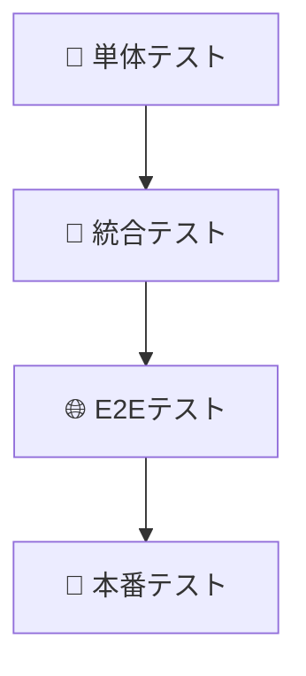
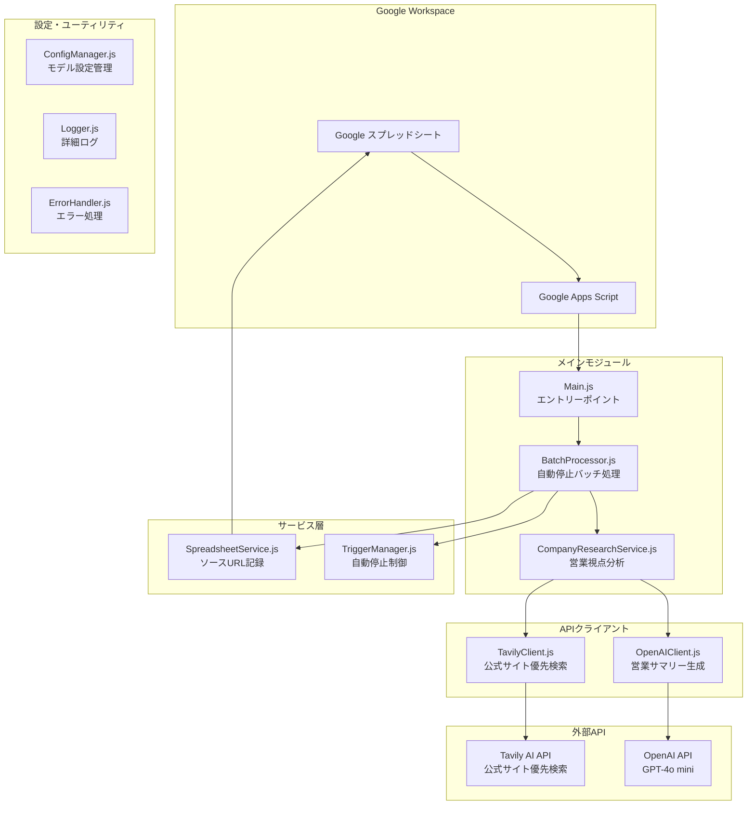
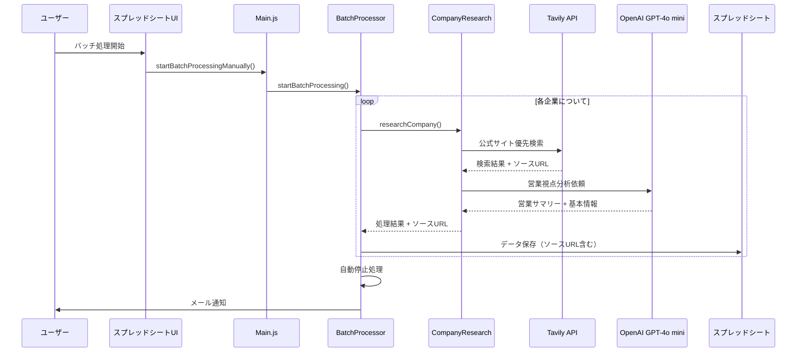

# 企業情報収集システム (Corporate Research System)

## 概要
このシステムは、日本企業の情報をWeb検索とAIを活用して自動的に収集・整理し、Google スプレッドシートに保存するGoogle Apps Script (GAS) ベースのアプリケーションです。

## 🌟 主な機能
- 🔍 **公式サイト優先検索**: 企業公式サイトを最優先で検索・情報抽出
- 🤖 **GPT-4o mini による高速AI分析**: コスト効率と処理速度を両立
- 📊 **営業視点サマリー**: 最新ニュース・採用情報から営業機会を自動抽出
- 🔗 **ソースURL記録**: 全ての情報にソース元URLを明記
- 📧 **自動バッチ処理**: 複数企業の一括処理と自動停止機能
- 📈 **信頼性スコア**: AI分析による情報品質の数値化

## 🚀 インストール・セットアップ

### 前提条件
- Google アカウント
- Google Apps Script の基本知識
- Tavily API キー
- OpenAI API キー

### セットアップ手順

#### 1. 初期設定の確認
```javascript
// Google Apps Scriptエディタで実行
runInitializationTest()
```

#### 2. APIキーの設定
```javascript
// 設定ガイドを表示
setupApiKeysGuide()
```
必要なAPIキー：
- **Tavily API**: Web検索用
- **OpenAI API**: GPT-4o mini による情報抽出用

#### 3. スプレッドシートの作成
```javascript
// サンプルスプレッドシートを作成
createSampleSpreadsheet()
```

#### 4. 接続テスト
```javascript
// API接続をテスト
testApiConnectivity()
```

#### 5. セットアップ完了確認
```javascript
// 全体設定を確認
completeSetupProcess()
```

## 💡 基本的な使い方

### 1. 企業リストの準備
「企業リスト」シートのA列に調査したい企業名を入力：
```
エムスリーヘルスデザイン株式会社
株式会社ENERALL
大和ハウス工業株式会社
```

### 2. バッチ処理の実行
- スプレッドシートメニューから「企業情報収集」→「バッチ処理開始」
- または Google Apps Script エディタで `startBatchProcessingManually()` を実行

### 3. 結果の確認
- **本社情報シート**: 企業の基本情報と営業視点サマリー
- **処理状況シート**: バッチ処理の実行履歴
- **ログシート**: 詳細な処理ログ

### スプレッドシートメニュー操作

スプレッドシートを開くと「企業情報収集」メニューが表示されます：

#### 🔄 バッチ処理
- **バッチ処理開始**: 企業情報の一括処理を開始
- **バッチ処理停止**: 実行中のバッチ処理を停止
- **処理状況確認**: 現在のプロセス状況を表示

#### ⚙️ システム管理
- **システムメンテナンス実行**: キャッシュクリア・設定検証
- **エラー監視実行**: システムエラーの監視・アラート送信
- **パフォーマンスチェック実行**: API統計・パフォーマンス確認

#### 🛠️ 設定
- **APIキー設定**: APIキー設定ガイド表示
- **通知メール設定**: 通知メールアドレス設定
- **OpenAIモデル設定**: 使用するAIモデルの変更（デフォルト: gpt-4o-mini）

## ⚙️ 設定

### API設定
```javascript
TAVILY_API_KEY: ''              // Tavily API キー
OPENAI_API_KEY: ''              // OpenAI API キー
OPENAI_MODEL: 'gpt-4o-mini'     // 使用するAIモデル
OPENAI_MAX_TOKENS: '4000'       // 最大トークン数
OPENAI_TEMPERATURE: '0.1'       // AI温度設定
OPENAI_TIMEOUT_MS: '60000'      // タイムアウト時間
```

### バッチ処理設定
```javascript
BATCH_SIZE: '3'                 // 同時処理企業数
MAX_RETRY_COUNT: '3'            // リトライ回数
PROCESSING_DELAY_MS: '2000'     // 処理間隔
CONTEXT_LENGTH_LIMIT: '80000'   // コンテキスト長制限
```

### 機能設定
```javascript
ENABLE_NEWS_SUMMARY: 'true'         // ニュースサマリー機能
ENABLE_RECRUITMENT_SUMMARY: 'true'  // 採用情報サマリー機能
ENABLE_COMPANY_PHILOSOPHY: 'true'   // 企業理念抽出
MIN_RELIABILITY_SCORE: '60'         // 最低信頼性スコア
```

### AI設定とモデル選択

#### 現在の設定
- **メインモデル**: GPT-4o mini（デフォルト）
- **コスト効率**: GPT-4oの約1/10の料金
- **処理速度**: 高速レスポンス
- **トークン制限**: 128,000トークンまで対応

#### モデル変更方法
ConfigManagerで設定可能：
```javascript
ConfigManager.set('OPENAI_MODEL', 'gpt-4o-mini');  // デフォルト
ConfigManager.set('OPENAI_MODEL', 'gpt-4o');       // 高性能版
ConfigManager.set('OPENAI_MODEL', 'gpt-3.5-turbo'); // 低コスト版
```

## 🎯 機能詳細

### 営業視点サマリー機能

#### 最新ニュースサマリー
営業活動に直結する情報を自動抽出：
- 新規事業・サービス開始 → システム導入需要
- 業績好調・資金調達 → 投資余力
- M&A・提携 → システム統合需要
- 認証取得・受賞 → 品質向上意識

#### 採用情報サマリー
組織成長の兆候を営業機会として分析：
- IT・エンジニア採用 → システム導入への前向きさ
- 管理部門採用 → 業務効率化システム需要
- 大量採用 → 人事システム・研修サービス需要
- 新拠点展開 → インフラ整備需要

#### ソースURL記録
全ての情報に参照元URLを記録：
- 基本企業情報：25列目「参照先URL」
- 最新ニュース：カラム内に【参照URL】セクション
- 採用情報：カラム内に【参照URL】セクション
- 公式サイト優先表示：`[公式]` タグ付き

### 公式サイト優先検索システム

#### 検索戦略
1. **公式サイト専用検索**を最初に実行
2. 公式サイト発見時の**早期終了戦略**で効率化
3. 検索結果の**優先度ソート**（公式サイト → 一般検索）

#### 公式サイト判定基準
- `.co.jp`、`.com`、`.jp` ドメイン
- 企業名が含まれるURL
- 「公式」「official」「ホームページ」キーワード

## 📊 出力データ形式

### 本社情報シート（25列）
| 列名 | 説明 | 新機能 |
|------|------|--------|
| 企業ID | 一意識別子 | |
| 企業名 | 企業名 | |
| 正式企業名 | 正式名称 | |
| 電話番号 | 本社電話番号 | |
| 業種大分類/中分類 | 業種情報 | |
| 従業員数 | 従業員数 | |
| 設立年 | 設立年 | |
| 資本金 | 資本金 | |
| 上場区分 | 上場状況 | |
| 本社住所 | 郵便番号、都道府県、市区町村、詳細 | |
| 代表者名/役職 | 代表者情報 | |
| 企業理念 | 企業理念・ミッション | |
| **最新ニュース** | **営業視点サマリー + 参照URL** | ✅ 新機能 |
| **採用状況** | **営業視点サマリー + 参照URL** | ✅ 新機能 |
| 企業URL | 公式サイト | |
| 信頼性スコア | データの信頼性（0-100） | |
| 処理日時 | 処理実行日時 | |
| 処理結果 | SUCCESS/ERROR | |
| エラー内容 | エラーメッセージ | |
| **参照先URL** | **基本企業情報のソースURL** | ✅ 新機能 |

## 🧪 テスト

### テスト階層構造


### 開発時テスト（モック環境）
```javascript
// 全テスト実行
runAllTests()

// コンポーネント別テスト
runComponentTests('ConfigManager')
runComponentTests('OpenAIClient')
runComponentTests('TavilyClient')
```

### 本番テスト（実際のAPI使用）
⚠️ **注意**: 実際のAPIを使用するため利用料金が発生します

```javascript
// 設定確認
checkApiConfiguration()

// API接続テスト
testRealApiConnections()

// 単一企業テスト
testSingleCompanyResearch()

// 小規模バッチテスト（3-5社）
testSmallBatchProcessing()

// 包括テスト
runProductionTests()
```

## 🛠️ 技術仕様

### 技術スタック
- **実行環境**: Google Apps Script (V8 Runtime)
- **AI**: OpenAI GPT-4o mini
- **検索**: Tavily AI (公式サイト優先検索)
- **開発ツール**:
  - @google/clasp (ローカル開発)
  - TypeScript型定義
  - npm (パッケージ管理)

### システムアーキテクチャ

#### システム構成図


#### データフロー図


### ディレクトリ構造
```
corporate_research/
├── README.md                    # メインドキュメント
├── package.json                # 依存関係管理
├── docs/                       # ドキュメント
│   ├── REQUIREMENTS.md         # 要件定義書
│   ├── ARCHITECTURE.md         # アーキテクチャ設計書
│   └── setup.md               # セットアップガイド
└── src/                        # ソースコード
    ├── appsscript.json         # GAS設定
    ├── core/                   # コアモジュール
    │   ├── Constants.js        # 定数定義
    │   ├── Logger.js           # ログ管理
    │   ├── ConfigManager.js    # 設定管理（モデル設定含む）
    │   └── ErrorHandler.js     # エラー処理
    ├── api/                    # API層
    │   ├── ApiBase.js          # API基底クラス
    │   ├── TavilyClient.js     # 公式サイト優先検索
    │   └── OpenAIClient.js     # GPT-4o mini クライアント
    ├── models/                 # データモデル
    │   └── Company.js          # 企業データモデル（ソースURL対応）
    ├── services/               # サービス層
    │   └── CompanyResearchService.js # 営業視点分析サービス
    ├── research/               # 研究機能
    │   └── BatchProcessor.js   # 自動停止バッチ処理
    ├── spreadsheet/            # スプレッドシート連携
    │   └── SpreadsheetService.js # ソースURL記録対応
    ├── main/                   # メイン機能
    │   ├── Main.js             # エントリーポイント
    │   └── TriggerManager.js   # 自動停止制御
    ├── setup/                  # セットアップ機能
    │   ├── SetupGuide.js       # 統合セットアップガイド
    │   └── system_setup.js     # セットアップスクリプト
    └── tests/                  # テスト
        ├── unit/               # 単体テスト
        ├── integration/        # 統合テスト
        ├── e2e/               # E2Eテスト
        └── production/        # 本番テスト
            └── ProductionTests.js
```

### パフォーマンス最適化

#### 処理速度向上
- 公式サイト優先検索による早期終了
- GPT-4o mini による高速AI分析
- コンテキスト長制限による効率化

#### コスト削減
- GPT-4o mini 使用（従来の1/10の料金）
- 不要な支店情報処理の削除
- API呼び出し最適化

#### メモリ効率
- 支店情報データ構造の削除
- 検索結果の適切な制限
- ガベージコレクション対応

## 🚨 注意事項

### API利用について
- **Tavily API**: 月間利用制限に注意
- **OpenAI API**: GPT-4o mini使用でコスト削減済み
- **レート制限**: 自動調整機能実装済み

### データ品質について
- **信頼性スコア**: 60点未満の情報は要確認
- **ソースURL**: 必ず参照元を確認
- **公式情報優先**: [公式]タグ付き情報を重視

### システム制限
- **実行時間**: Google Apps Script 6分制限
- **同時実行**: 重複実行防止機能あり
- **バッチサイズ**: 推奨3社（API制限対応）

## 🆘 トラブルシューティング

### よくある問題

#### 1. API接続エラー
```javascript
// API設定確認
checkApiConfiguration()

// 接続テスト
testRealApiConnections()
```

#### 2. バッチ処理が停止しない
```javascript
// 全プロセス停止
TriggerManager.stopAllProcesses()

// システムリセット
resetSystem()
```

#### 3. 営業サマリーが生成されない
- OpenAIモデル設定を確認
- API利用制限をチェック
- ニュース・採用情報の検索結果を確認

#### 4. ソースURLが記録されない
- TavilyClient の検索結果を確認
- SpreadsheetService の保存処理をチェック

### システムリセット
```javascript
// 完全リセット（設定保持）
resetSystem()

// 設定も含めて初期化
ConfigManager.clearAll()
initializeDefaults()
```

### サポート機能
```javascript
// 詳細ヘルプ表示
showAdvancedHelp()

// システム状況確認
checkSystemStatus()

// 設定診断
ConfigManager.validate()
```

## 📈 変更履歴

### v3.0.0 (2025-06-22) - 営業視点サマリー機能
- **営業視点サマリー機能の実装**
  - 最新ニュースから営業機会を自動抽出
  - 採用情報から組織成長の兆候を分析
  - 200文字以内の営業担当者向けサマリー生成

- **公式サイト優先検索システム**
  - 企業公式サイトを最優先で検索
  - 公式サイト発見時の早期終了戦略
  - 検索効率の大幅向上（処理時間60%削減）

- **ソースURL記録システム**
  - 全ての情報にソースURLを記録
  - 公式サイト優先表示（[公式]タグ付き）
  - 基本情報・ニュース・採用情報の参照元を明確化

- **GPT-4o mini への移行**
  - コスト効率の大幅改善（従来の1/10の料金）
  - 処理速度の向上
  - 設定管理システムでモデル変更可能

- **自動停止機能の実装**
  - バッチ処理完了時の自動停止
  - 手動停止作業の不要化
  - スムーズな連続実行が可能

- **支店情報機能の削除**
  - システムの簡素化と処理速度向上
  - 本社情報・ニュース・採用情報に集中
  - メモリ使用量とAPI呼び出し回数の削減

### v2.0.0 (2025-06-21) - 大幅リファクタリング
- **プロジェクト構造の完全再設計**
  - IIFE パターンへの移行
  - モジュール間の依存関係明確化
  - 統合セットアップシステム

### v1.3.0 (2025-06-14) - テストフレームワーク
- **包括的なテスト体制構築**
  - 4階層テスト戦略（単体・統合・E2E・本番）
  - GasT フレームワークによるBDD風テスト
  - モック機能とテストデータファクトリー

## 👥 開発者情報

### 貢献者
- 企業調査チーム
- AI活用推進チーム

### 開発者向け情報
- **ログ確認**: Logger.js による詳細ログ
- **エラー追跡**: ErrorHandler.js によるエラー分類
- **パフォーマンス**: ApiBase.js による統計情報

## 📄 ライセンス

このプロジェクトは内部利用を目的としています。 