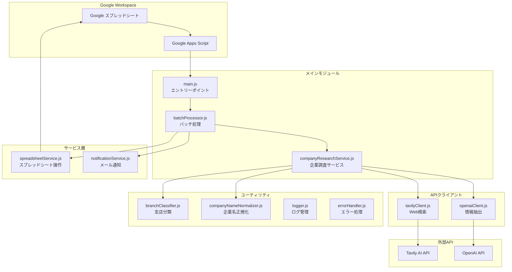
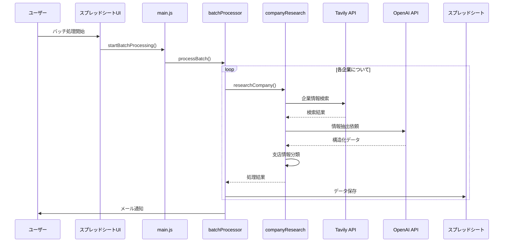

# 企業情報収集システム (Corporate Research System)

## 概要
このシステムは、日本企業の情報をWeb検索とAIを活用して自動的に収集・整理し、Google スプレッドシートに保存するGoogle Apps Script (GAS) ベースのアプリケーションです。

## 主な機能
- 🔍 **企業情報の自動収集**: Tavily AI を使用したWeb検索
- 🤖 **AI による情報抽出**: OpenAI GPT-4 による構造化データ抽出
- 📊 **スプレッドシート連携**: 本社・支店情報の自動保存
- 🏢 **支店情報の詳細抽出**: 住所、電話番号、従業員数、営業時間など
- 📧 **バッチ処理とメール通知**: 複数企業の一括処理

## システム構成図



## データフロー図



## ディレクトリ構造

```
corporate_research/
├── README.md                 # メインドキュメント
├── package.json             # 依存関係管理
├── docs/                    # ドキュメント
│   ├── REQUIREMENTS.md      # 要件定義書
│   ├── ARCHITECTURE.md      # アーキテクチャ設計書
│   └── setup.md            # セットアップガイド
└── src/                     # ソースコード（Google Apps Scriptにプッシュされる）
    ├── appsscript.json      # GAS設定
    ├── core/                # コアモジュール
    │   ├── Constants.js     # 定数定義
    │   ├── Logger.js        # ログ管理
    │   ├── ConfigManager.js # 設定管理
    │   └── ErrorHandler.js  # エラー処理
    ├── api/                 # API層
    │   ├── ApiBase.js       # API基底クラス
    │   ├── TavilyClient.js  # Tavily API クライアント
    │   └── OpenAIClient.js  # OpenAI API クライアント
    ├── models/              # データモデル
    │   └── Company.js       # 企業データモデル
    ├── research/            # 企業調査機能
    │   ├── CompanyResearchService.js # 企業調査サービス
    │   └── BatchProcessor.js         # バッチ処理
    ├── spreadsheet/         # スプレッドシート連携
    │   └── SpreadsheetService.js # スプレッドシート操作
    ├── main/                # メイン機能
    │   ├── Main.js          # エントリーポイント
    │   └── TriggerManager.js # トリガー管理
    ├── setup/               # セットアップ機能
    │   ├── SetupGuide.js    # 統合セットアップガイド
    │   └── system_setup.js  # セットアップスクリプト
    ├── tests/               # テスト
    │   └── SystemTest.js    # システムテスト
    └── utils/               # ユーティリティ（今後拡張予定）

```

## 📊 出力データ形式

### 本社情報シート
| 列名 | 説明 |
|------|------|
| 企業ID | 一意識別子 |
| 企業名 | 企業名 |
| 正式企業名 | 正式名称 |
| 電話番号 | 本社電話番号 |
| 業種大分類/中分類 | 業種情報 |
| 従業員数 | 従業員数 |
| 設立年 | 設立年 |
| 資本金 | 資本金 |
| 本社住所 | 郵便番号、都道府県、市区町村、詳細 |
| 代表者名/役職 | 代表者情報 |
| 企業理念 | 企業理念・ミッション |
| 最新ニュース | 最新情報 |
| 採用状況 | 採用情報 |
| 企業URL | 公式サイト |
| 信頼性スコア | データの信頼性（0-100） |

### 支店情報シート
| 列名 | 説明 |
|------|------|
| 企業ID | 本社との紐付け |
| 支店名 | 支店・営業所名 |
| 支店電話番号 | 電話番号 |
| 支店住所 | 郵便番号、都道府県、市区町村、詳細 |
| 支店種別 | 支社/支店/営業所/工場等 |
| 主要度ランク | 重要度（1-5） |
| 従業員数 | 支店の従業員数 |
| 営業時間 | 営業時間 |
| 備考 | その他情報 |

## 主要コンポーネントの説明

### 1. CompanyResearchService
企業情報調査の中核となるサービス。以下の処理を実行：
- Web検索クエリの最適化
- 中小企業向け特別検索
- OpenAIによる情報抽出
- 支店情報の分類と整理

### 2. TavilyClient
Tavily AI APIを使用したWeb検索クライアント：
- 日本語企業情報に最適化
- 複数の検索戦略（基本、詳細、フォールバック）
- 検索結果の品質評価

### 3. OpenAIClient
GPT-4を使用した情報抽出：
- 構造化されたJSONスキーマに基づく抽出
- 支店情報の詳細な抽出指示
- 住所、電話番号、営業時間などの正確な抽出

### 4. BranchClassifier
本社・支店の分類ユーティリティ：
- キーワードベースの分類
- 住所情報からの拠点タイプ判定
- 重要度ランクの自動計算

## セットアップ手順

### 🚀 クイックスタート

Google Apps Script エディタで以下を実行するだけで始められます：

```javascript
// 1. セットアップガイドを表示
SetupGuide.showWelcome()

// 2. システム状況確認
SetupGuide.checkStatus()

// 3. クイックセットアップ実行
SetupGuide.quickSetup()
```

### 📋 詳細セットアップ手順

1. **システム初期化**
   ```javascript
   runInitializationTest()
   ```

2. **APIキーの設定**
   ```javascript
   SetupGuide.showApiKeyGuide()  // 設定方法を表示
   ```
   - Google Apps Scriptエディタで「プロジェクトの設定」→「スクリプトプロパティ」
   - 以下を設定：
     - `TAVILY_API_KEY`: Tavily AIのAPIキー
     - `OPENAI_API_KEY`: OpenAIのAPIキー
     - `NOTIFICATION_EMAIL`: 通知用メールアドレス

3. **API接続テスト**
   ```javascript
   testApiConnectivity()
   ```

4. **スプレッドシート準備**
   ```javascript
   createSampleSpreadsheet()
   ```

5. **トリガー設定**
   ```javascript
   setupTriggers()
   ```

6. **セットアップ完了確認**
   ```javascript
   SetupGuide.verifyComplete()
   ```

詳細なセットアップ手順は [setup.md](docs/setup.md) を参照してください。

## 🚀 使い方

### 基本的な使い方

#### 1. 企業調査テスト
```javascript
testSampleCompanyResearch()
```

#### 2. バッチ処理の開始
```javascript
startBatchProcessing()
```

#### 3. システム状況確認
```javascript
SetupGuide.checkStatus()
```

### テスト実行

#### システムテスト
```javascript
// 完全システムテスト
runSystemTests()

// 初期化テスト
runInitializationTest()

// クイックテスト
runQuickTest()
```

### セットアップ関連

#### セットアップガイド
```javascript
// ヘルプ表示
SetupGuide.showHelp()

// API設定ガイド
SetupGuide.showApiKeyGuide()

// セットアップ状況確認
SetupGuide.checkStatus()
```

## 🧪 テスト

### テスト構成

本システムでは、4階層の包括的なテスト体制を構築しています：

- **Level 1 - 基本テスト**: カラムマッピングの基本動作確認
- **Level 2 - 単体テスト**: 各コンポーネントの個別機能をテスト
- **Level 3 - ワークフローテスト**: 実際の業務フローに基づく実践的テスト
- **Level 4 - システムテスト**: 完全な統合テストと検証
- **APIカラムテスト（新機能）**: 実APIでのカラム単位データ取得検証

### テスト実行方法

#### 1. 階層別テスト実行
```javascript
// Level 1: 基本テスト
executePhase1()

// Level 2: 単体テスト
runDetailedUnitTests()

// Level 3: ワークフローテスト
runAllWorkflowTests()

// Level 4: 完全システムテスト
runCompleteSystemTest()
```

#### 2. APIカラムテスト（実APIを使用）
```javascript
// 単一企業でテスト
runApiColumnTest('トヨタ自動車株式会社', true)

// 複数企業で一括テスト
runMultipleApiColumnTests(['企業1', '企業2', '企業3'])
```
- 本社情報25カラムの個別検証
- 支店情報10カラムの個別検証
- 結果は「APIカラムテスト結果」シートに自動保存

#### 3. 簡易テスト（開発確認用）
```javascript
runQuickTest()
```
- 重要な機能のみを素早くテスト
- 開発中の動作確認に最適
- 実行時間: 約30秒

#### 4. npm経由でのテスト実行
```bash
npm run test:unit        # 単体テスト
npm run test:integration # 統合テスト
npm run test:all        # 全テスト
```

### テスト結果の確認

#### コンソール出力
テスト実行時にリアルタイムで結果が表示されます：
```
=== テストスイート開始: CompanyNameNormalizer 単体テスト ===
  → テスト実行: 基本的な企業名正規化
    ✓ （株）が株式会社に変換される
    ✓ 変更履歴が記録される
    ✓ 信頼度が適切に設定される
    ✓ 基本的な企業名正規化 (15ms)
```

#### スプレッドシート保存
テスト結果は自動的にスプレッドシートの「テスト結果」シートに保存されます。

### テスト設定の確認

```javascript
// テスト環境の確認
checkTestConfiguration()

// テストヘルプの表示
showTestHelp()
```

### ワークフローテストの詳細

ワークフローテストは、実際の業務フローに基づいて設計された実践的なテストです。従来の単体・統合テストとは異なり、実際のスプレッドシート操作とデータフローを検証します。

#### 1. 企業リスト → 本社情報取得ワークフロー
```javascript
testCompanyListToHeadquartersWorkflow()
```
**このテストの内容:**
- スプレッドシートの「企業リスト」シートから企業名を実際に取得
- 企業名の正規化処理が正常に動作することを確認
- Web検索（モック使用）と情報抽出の統合フローをテスト
- 本社情報のCompanyオブジェクト作成と住所パースをテスト
- スプレッドシートへの本社情報保存を実際に実行して確認

**検証項目:**
- 企業リストシートの存在と企業名取得
- 企業名正規化の動作確認
- APIクライアント（モック）との統合
- 本社情報の適切なオブジェクト化
- スプレッドシートへの正常な保存

#### 2. 本社情報 → 支店情報取得ワークフロー
```javascript
testHeadquartersToBranchesWorkflow()
```
**このテストの内容:**
- スプレッドシートの「本社情報」シートから企業データを実際に取得
- 支店情報専用検索クエリの動作確認（モック使用）
- 本社・支店の分類処理をリアルなデータで検証
- 支店情報のBranchオブジェクト作成をテスト
- スプレッドシートへの支店情報保存を実際に実行

**検証項目:**
- 本社情報シートからのデータ取得
- 支店専用検索の動作確認
- 本社・支店分類の精度
- 支店オブジェクトの適切な作成
- 支店情報の正確なスプレッドシート保存

#### 3. エンドツーエンドワークフロー
```javascript
testEndToEndWorkflow()
```
**このテストの内容:**
- 企業名入力から支店情報保存までの完全フローを一気通貫でテスト
- 各段階での関数連携とデータ受け渡しを検証
- モックAPIを使用した安全な統合テスト
- 実際の処理フローと同等の手順で実行

**検証項目:**
- 完全な処理フローの動作確認
- 各段階でのデータ変換の正確性
- エラーハンドリングの適切性
- 最終的な成果物の品質

#### ワークフローテストの利点

**1. 実際の使用パターンに基づくテスト**
- 理論的なテストではなく、実際の業務フローをそのままテスト
- ユーザーが実際に行う操作と同じ手順でテストを実行
- 実運用での問題を事前に発見可能

**2. スプレッドシート連携の確実性**
- 実際のGoogle スプレッドシートとの連携をテスト
- シート構造やデータ形式の整合性を確認
- 権限やアクセスの問題を早期発見

**3. データフローの追跡**
- 企業リスト → 本社情報 → 支店情報の完全なデータフローを検証
- 各段階でのデータ変換と品質を確認
- 情報の欠損や不整合を防止

**4. 統合的な動作確認**
- 複数のコンポーネントが連携した際の動作を確認
- 単体では正常でも統合時に問題が生じるケースを発見
- システム全体としての健全性を保証

#### ワークフローテストの実行タイミング

**開発時の推奨実行パターン:**
```javascript
// 1. 新機能開発前の現状確認
runAllWorkflowTests()

// 2. 本社情報関連の機能修正後
testCompanyListToHeadquartersWorkflow()

// 3. 支店情報関連の機能修正後  
testHeadquartersToBranchesWorkflow()

// 4. リリース前の最終確認
testEndToEndWorkflow()
```

### テストのベストプラクティス

#### 1. 定期実行
- 新機能開発前: `runQuickTest()`
- 機能実装後: `runComponentTest("対象コンポーネント")`
- ワークフロー確認: `runAllWorkflowTests()`
- リリース前: `runAllTestSuites()`

#### 2. CI/CD統合
```javascript
// 自動テスト実行用
function automatedTest() {
  const report = runAllTestSuites();
  if (report.summary.overallSuccessRate < 95) {
    throw new Error('テスト失敗率が5%を超えています');
  }
  return report;
}
```

#### 3. パフォーマンス監視
```javascript
// 定期的なパフォーマンスチェック
function weeklyPerformanceCheck() {
  const report = runPerformanceTest();
  // パフォーマンス基準値との比較
  return report;
}
```

### トラブルシューティング

#### テスト失敗の対処法

1. **個別コンポーネントの確認**
   ```javascript
   runComponentTest("失敗したコンポーネント名")
   ```

2. **設定の確認**
   ```javascript
   checkTestConfiguration()
   ```

3. **段階的テスト**
   ```javascript
   // 1. 簡易テストから開始
   runQuickTest()
   
   // 2. 単体テストのみ実行
   runUnitTestsOnly()
   
   // 3. 統合テストを実行
   runIntegrationTestsOnly()
   ```

#### よくある問題

| 問題 | 原因 | 解決方法 |
|------|------|----------|
| `ReferenceError: クラス名 is not defined` | 必要なファイルが読み込まれていない | 全ファイルがGoogle Apps Scriptにプッシュされているか確認 |
| テストタイムアウト | 処理が重い | `runQuickTest()`で基本機能を確認後、個別テストを実行 |
| スプレッドシートエラー | 権限不足 | スプレッドシートへの書き込み権限を確認 |

## 🔄 最近の改善点

### v2.0.0 (2025-06-21) - 大幅リファクタリング
- **プロジェクト構造の完全再設計**
  - IIFE (Immediately Invoked Function Expression) パターンへの移行
  - voice-transcription-appプロジェクトのベストプラクティスを採用
  - モジュール間の依存関係を明確化
  
- **統合セットアップシステム**
  - `SetupGuide.js`による一元化されたセットアップ体験
  - ステップバイステップのガイダンス機能
  - システム状況の自動診断とレポート機能
  
- **プロジェクト整理とクリーンアップ**
  - 不要なデバッグファイルの削除
  - 重複機能の統合
  - 可読性向上のためのディレクトリ構造最適化
  
- **改善されたエラーハンドリング**
  - 包括的なエラー分類システム
  - 自動エラー監視とアラート機能
  - 詳細なログ記録とパフォーマンス追跡

### v1.3.0 (2025-06-14)
- **テストフレームワークの大幅改善**
  - 包括的な単体・統合テストフレームワークを構築
  - **ワークフローテストの新規追加**：実際の業務フローに基づく実践的テスト
  - モック機能によるAPIテストの安全な実行
  - パフォーマンス・ストレステストの追加

### v1.2.0 (2025-06-14)
- **支店情報抽出の大幅改善**
  - OpenAIスキーマに支店情報専用フィールドを追加
  - 支店名、住所詳細（番地まで）、電話番号、従業員数、営業時間の抽出
  - 支店情報検索クエリの最適化

### v1.1.0 (2025-06-10)
- **検索精度の向上**
  - 企業名をそのまま使用する検索クエリに変更（正式名称での検索精度向上）
  - より具体的な検索キーワードの追加（本社、所在地、代表取締役など）
  
- **情報抽出の改善**
  - 電話番号フィールドの確実な抽出
  - 住所パースロジックの改善（市区町村の正確な抽出）
  - 本社・支店分類の精度向上

## 技術スタック

- **実行環境**: Google Apps Script (V8 Runtime)
- **外部API**: 
  - Tavily AI (Web検索)
  - OpenAI GPT-4 (情報抽出)
- **開発ツール**:
  - @google/clasp (ローカル開発)
  - TypeScript型定義
  - npm (パッケージ管理)

## 注意事項

- API利用制限に注意（レート制限対策実装済み）
- 大量データ処理時はバッチサイズを調整
- 個人情報の取り扱いに注意
- 定期的なAPIキーの更新を推奨

## トラブルシューティング

### よくある問題

1. **支店情報が抽出されない**
   - 検索クエリに「拠点一覧」「事業所」を含めているか確認
   - OpenAIのプロンプトで支店情報抽出が明示されているか確認

2. **住所の番地が欠落する**
   - parseAddressString関数の処理を確認
   - OpenAIスキーマで「住所詳細」フィールドが定義されているか確認

3. **API制限エラー**
   - バッチサイズを小さくする
   - API呼び出し間隔を調整（Utilities.sleep）

## ライセンス

このプロジェクトは内部利用を目的としています。

## 貢献者

- 企業調査チーム 