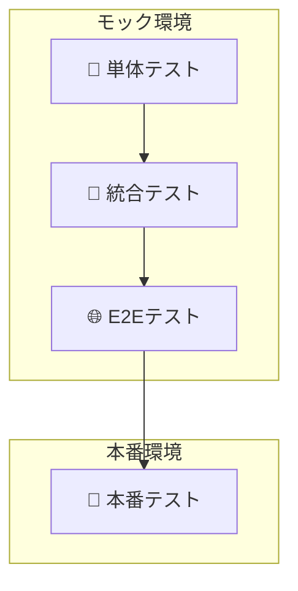
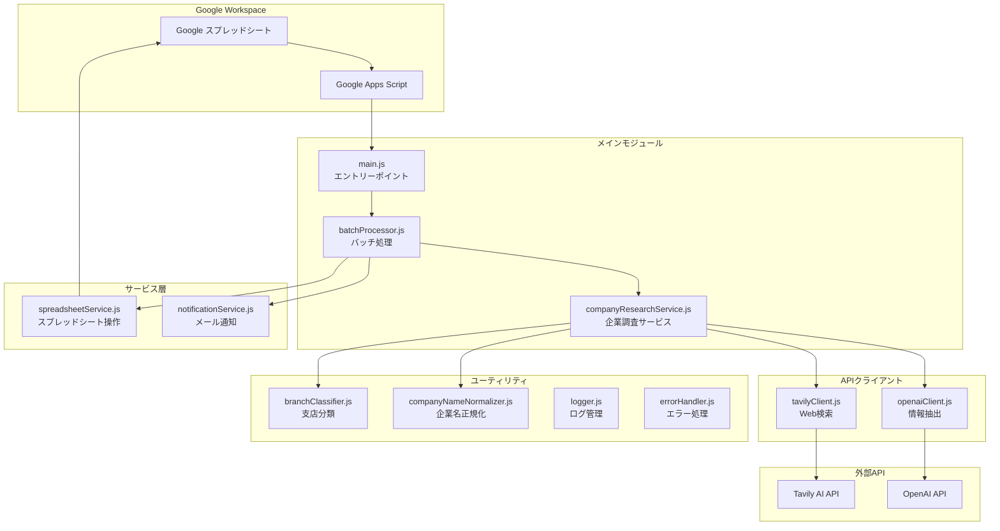
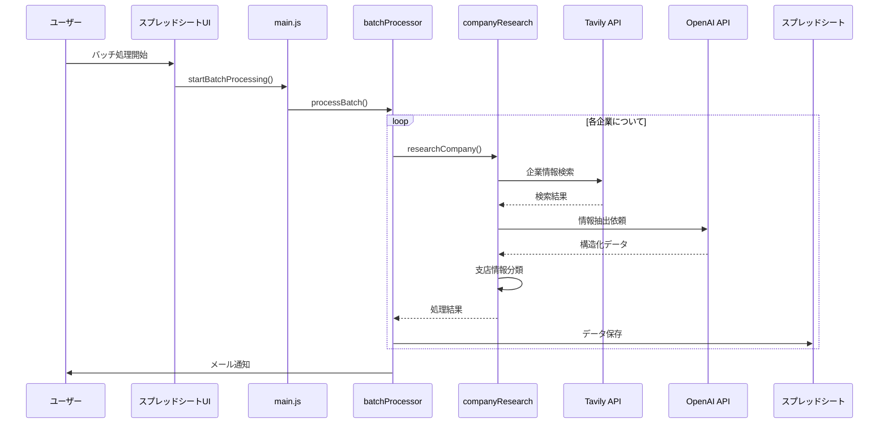

# 企業情報収集システム (Corporate Research System)

## 概要
このシステムは、日本企業の情報をWeb検索とAIを活用して自動的に収集・整理し、Google スプレッドシートに保存するGoogle Apps Script (GAS) ベースのアプリケーションです。

## 主な機能
- 🔍 **企業情報の自動収集**: Tavily AI を使用したWeb検索
- 🤖 **AI による情報抽出**: OpenAI GPT-4 による構造化データ抽出
- 📊 **スプレッドシート連携**: 本社・支店情報の自動保存
- 🏢 **支店情報の詳細抽出**: 住所、電話番号、従業員数、営業時間など
- 📧 **バッチ処理とメール通知**: 複数企業の一括処理

## 🎮 手動制御システム

### システムの変更点

**重要**: このシステムは時間ベースの自動実行から**完全手動制御**に変更されました。

- ❌ **廃止**: 自動トリガー（4時間毎のバッチ処理、日次メンテナンス等）
- ✅ **新機能**: スプレッドシートメニューからの手動実行
- ✅ **新機能**: リアルタイムプロセス状況確認
- ✅ **新機能**: 個別プロセスの開始・停止制御

### 🚀 セットアップ手順

1. **システム確認**
   ```javascript
   runInitializationTest()
   ```

2. **APIキー設定**
   ```javascript
   setupApiKeysGuide()
   ```

3. **API接続テスト**
   ```javascript
   testApiConnectivity()
   ```

4. **スプレッドシート作成**
   ```javascript
   createSampleSpreadsheet()
   ```

5. **手動制御システム初期化**
   ```javascript
   initializeManualControlSystem()
   ```

6. **セットアップ完了確認**
   ```javascript
   completeSetupProcess()
   ```

### 📱 スプレッドシートメニュー操作

スプレッドシートを開くと「企業情報収集」メニューが表示されます：

#### 🔄 バッチ処理
- **バッチ処理開始**: 企業情報の一括処理を開始
- **バッチ処理停止**: 実行中のバッチ処理を停止
- **処理状況確認**: 現在のプロセス状況を表示

#### ⚙️ システム管理
- **システムメンテナンス実行**: キャッシュクリア・設定検証
- **エラー監視実行**: システムエラーの監視・アラート送信
- **パフォーマンスチェック実行**: API統計・パフォーマンス確認
- **全プロセス停止**: すべての実行中プロセスを停止

#### 🛠️ 設定
- **APIキー設定**: APIキー設定ガイド表示
- **通知メール設定**: 通知メールアドレス設定
- **スプレッドシート設定**: スプレッドシート設定確認・更新

### 🎯 手動制御の利点

1. **完全制御**: ユーザーが必要な時にのみ処理を実行
2. **リソース効率**: 不要な自動実行によるAPI使用量削減
3. **エラー回避**: Google Apps Scriptの実行時間制限を回避
4. **リアルタイム監視**: 処理状況をリアルタイムで確認可能
5. **柔軟な運用**: 業務スケジュールに合わせた処理実行

### 🧪 システムテスト

#### 手動制御システムテスト
```javascript
testManualControlSystem()  // 完全テスト
quickTestManualControl()   // クイックテスト
```

#### 個別機能テスト
```javascript
// プロセス状況確認
TriggerManager.getAllProcessStatus()

// システムメンテナンス
TriggerManager.executeSystemMaintenance()

// エラー監視
TriggerManager.executeErrorMonitoring()

// パフォーマンスチェック
TriggerManager.executePerformanceCheck()
```

### 🔧 トラブルシューティング

#### 既存の自動トリガーを削除
```javascript
// すべての自動トリガーを削除
TriggerManager.deleteAllTriggers()

// システムリセット（トリガー削除 + キャッシュクリア）
resetSystem()
```

#### プロセスが停止しない場合
```javascript
// 全プロセス強制停止
TriggerManager.stopAllProcesses()
```

#### メニューが表示されない場合
```javascript
// メニューを手動作成
createMenuManually()
```

### 📊 プロセス状況の確認

#### スプレッドシートから
1. 「企業情報収集」→「バッチ処理」→「処理状況確認」

#### スクリプトエディタから
```javascript
var status = TriggerManager.getAllProcessStatus();
console.log(status);
```

### 🚨 重要な注意事項

1. **自動実行なし**: システムは自動では何も実行しません
2. **手動開始必須**: すべての処理は手動で開始する必要があります
3. **処理時間制限**: Google Apps Scriptの6分制限は引き続き適用されます
4. **同時実行制限**: 同一プロセスの重複実行は防止されています

### 📈 使用推奨パターン

#### 日常運用
1. **朝**: システムメンテナンス実行
2. **業務時間**: 必要に応じてバッチ処理実行
3. **夕方**: エラー監視・パフォーマンスチェック実行

#### 定期メンテナンス
1. **週次**: 全プロセス停止 → システムリセット → 再初期化
2. **月次**: API使用量確認 → パフォーマンス最適化

### 🆘 サポート

問題が発生した場合：

1. **ヘルプ表示**
   ```javascript
   showAdvancedHelp()
   ```

2. **システム状況確認**
   ```javascript
   checkSystemStatus()
   ```

3. **完全リセット**
   ```javascript
   resetSystem()
   ```

## 💡 主な使い方

### 1. 調査したい企業をリストに追加
- 「企業リスト」シートのA列に、調査したい会社の名前を一行ずつ入力します。

### 2. バッチ処理を実行
- Google Apps Scriptエディタで `src/main/Main.js` を開き、`startBatchProcessing` 関数を実行します。
- これにより、「企業リスト」シートに記載された企業の調査が開始されます。

### 3. 結果を確認
- 処理が完了すると、「本社情報」シートと「支店情報」シートに収集されたデータが書き込まれます。
- スクリプトプロパティで `NOTIFICATION_EMAIL` を設定している場合、処理完了後にメールで通知が届きます。

---

## 🧪 テスト実行ガイド

このプロジェクトでは、品質を保証するために4階層のテスト戦略を採用しています。それぞれのテストが異なる目的を持ち、開発の各フェーズで品質を確保します。



| テスト種別 | 目的 | 実行環境 | 特徴 |
|---|---|---|---|
| **単体テスト** | モジュール単体の動作を検証 | モック | 高速・高頻度で実行 |
| **統合テスト** | 複数モジュール間の連携を検証 | モック | 単体テストより広範囲 |
| **E2Eテスト** | ユーザーの操作フロー全体を検証 | モック | 実運用に近いシナリオ |
| **本番テスト** | 実際のAPIやデータで最終検証 | **本番** | リリース前の最終確認 |

### 1. 単体テスト (Unit Tests)

**目的**:
個別の関数やクラス（モジュール）が、意図した通りに正しく動作するかを検証します。外部の依存関係（API、スプレッドシートなど）はすべてモックに置き換えて、テスト対象のロジックのみに集中します。

**実行方法**:
- **すべての単体テストを実行**: `TestRunner.js` -> `runUnitTests()`
- **特定のコンポーネントのテストを実行**: `TestRunner.js` -> `runComponentTests('コンポーネント名')`
  - 例: `runComponentTests('ConfigManager')`

**対象ファイル**: `src/tests/unit/`

---

### 2. 統合テスト (Integration Tests)

**目的**:
複数のモジュールを組み合わせたときに、それらが正しく連携して動作するかを検証します。例えば、「企業調査サービスがAPIクライアントを呼び出し、結果を正しく処理できるか」といったシナリオを確認します。単体テスト同様、外部APIなどはモック化します。

**実行方法**:
- **すべての統合テストを実行**: `TestRunner.js` -> `runIntegrationTests()`

**対象ファイル**: `src/tests/integration/`

---

### 3. E2Eテスト (End-to-End Tests)

**目的**:
ユーザーの操作を模倣し、アプリケーション全体のワークフローが最初から最後まで正常に完了するかを検証します。「企業リストを読み込み、情報を収集し、スプレッドシートに書き込む」といった一連の流れをテストします。このテストもモック環境で実行し、システム全体のロジックに不整合がないかを確認します。

**実行方法**:
- **すべてのE2Eテストを実行**: `TestRunner.js` -> `runE2ETests()`

**対象ファイル**: `src/tests/e2e/`

---

### 4. 本番テスト (Production Tests)

**🚨 注意: このテストは実際のAPIを呼び出し、実際のデータを扱います。APIの利用料金や、データの上書きに十分注意してください。**

**目的**:
モック環境では確認できない、実際の外部APIとの接続や、本番環境特有の問題を検出するための最終テストです。リリース前の最終的な品質保証として実施します。

**実行方法**:
`src/tests/production/ProductionTests.js` ファイル内の関数を実行します。

**推奨される実行手順**:
1.  **設定確認 (`checkApiConfiguration`)**: APIキーやスプレッドシートIDが正しく設定されているかを確認します。
2.  **API接続テスト (`testRealApiConnections`)**: TavilyとOpenAIのAPIに実際に接続できるかを確認します。
3.  **単一企業テスト (`testSingleCompanyResearch`)**: 1社分の調査を実際に実行し、データが取得できるかを確認します。
4.  **小規模バッチテスト (`testSmallBatchProcessing`)**: 3〜5社程度の小さなバッチ処理が正常に動作するかを確認します。
5.  **実際のスプレッドシートテスト (`testRealSpreadsheetProcessing`)**: 実際のスプレッドシートから企業リストを読み込み、2社まで処理してデータ保存を確認します。
6.  **包括テスト (`runProductionTests`)**: 上記を含むすべての本番テストを順次実行します。リリース前の最終確認に最適です。

#### 本番テストの詳細

| テスト関数 | 目的 | 処理内容 | 所要時間 |
|---|---|---|---|
| `checkApiConfiguration` | 設定確認 | APIキー・スプレッドシートID等の設定値検証 | 数秒 |
| `testRealApiConnections` | API接続 | Tavily・OpenAI APIへの実際の接続テスト | 10-20秒 |
| `testSingleCompanyResearch` | 単一企業 | 固定企業（大和ハウス工業）での完全な調査プロセス | 40-60秒 |
| `testSmallBatchProcessing` | 小規模バッチ | 教育業界3社（ベネッセ・学研・栄光）での並列処理 | 2-3分 |
| `testRealSpreadsheetProcessing` | 実スプレッドシート | 実際のスプレッドシートから企業リストを読み込み、最大2社まで処理 | 1-2分 |
| `runProductionTests` | 包括テスト | 上記すべてを順次実行 | 5-8分 |

**⚠️ 重要な注意事項**:
- **API利用料金**: 本番テストでは実際のAPIを使用するため、利用料金が発生します。
- **データ上書き**: `testRealSpreadsheetProcessing`は実際のスプレッドシートにデータを書き込みます。
- **実行時間制限**: Google Apps Scriptの6分制限により、大量データのテストは分割実行が必要です。

---

### 開発フローとテスト戦略

**全体実行**:
`TestRunner.js` の `runAllTests()` を実行すると、単体・統合・E2Eテストがすべて実行されます。開発中はこれを基本とします。

**推奨テストフロー**:

1.  **機能開発時**:
    - `runUnitTests()` や `runComponentTests()` で、修正箇所の単体テストを頻繁に実行します。
    - 機能の区切りで `runAllTests()` を実行し、既存機能への影響（デグレード）がないか確認します。

2.  **リリース前**:
    - `runAllTests()` でモック環境でのテストがすべて成功することを確認します。
    - `runProductionTests()` を実行し、本番環境での動作を最終確認します。

### テストサポートツール
- **GasT Framework**: BDDスタイルの構文（`describe`, `it`, `expect`）でテストを記述できる、GAS専用の軽量テストフレームワークです。
- **MockFactory / TestDataFactory**: テスト用のモックオブジェクトやテストデータを簡単に生成するためのユーティリティです。

---

## 📐 システムアーキテクチャ

### システム構成図


### データフロー図


## 📁 ディレクトリ構造
```
corporate_research/
├── README.md                 # メインドキュメント
├── package.json             # 依存関係管理
├── docs/                    # ドキュメント
│   ├── REQUIREMENTS.md      # 要件定義書
│   ├── ARCHITECTURE.md      # アーキテクチャ設計書
│   └── setup.md            # セットアップガイド
└── src/                     # ソースコード（Google Apps Scriptにプッシュされる）
    ├── appsscript.json      # GAS設定
    ├── core/                # コアモジュール
    │   ├── Constants.js     # 定数定義
    │   ├── Logger.js        # ログ管理
    │   ├── ConfigManager.js # 設定管理
    │   └── ErrorHandler.js  # エラー処理
    ├── api/                 # API層
    │   ├── ApiBase.js       # API基底クラス
    │   ├── TavilyClient.js  # Tavily API クライアント
    │   └── OpenAIClient.js  # OpenAI API クライアント
    ├── models/              # データモデル
    │   └── Company.js       # 企業データモデル
    ├── research/            # 企業調査機能
    │   ├── CompanyResearchService.js # 企業調査サービス
    │   └── BatchProcessor.js         # バッチ処理
    ├── spreadsheet/         # スプレッドシート連携
    │   └── SpreadsheetService.js # スプレッドシート操作
    ├── main/                # メイン機能
    │   ├── Main.js          # エントリーポイント
    │   └── TriggerManager.js # トリガー管理
    ├── setup/               # セットアップ機能
    │   ├── SetupGuide.js    # 統合セットアップガイド
    │   └── system_setup.js  # セットアップスクリプト
    ├── tests/               # テスト
    │   └── SystemTest.js    # システムテスト
    └── utils/               # ユーティリティ（今後拡張予定）

```

## 📊 出力データ形式

### 本社情報シート
| 列名 | 説明 |
|------|------|
| 企業ID | 一意識別子 |
| 企業名 | 企業名 |
| 正式企業名 | 正式名称 |
| 電話番号 | 本社電話番号 |
| 業種大分類/中分類 | 業種情報 |
| 従業員数 | 従業員数 |
| 設立年 | 設立年 |
| 資本金 | 資本金 |
| 本社住所 | 郵便番号、都道府県、市区町村、詳細 |
| 代表者名/役職 | 代表者情報 |
| 企業理念 | 企業理念・ミッション |
| 最新ニュース | 最新情報 |
| 採用状況 | 採用情報 |
| 企業URL | 公式サイト |
| 信頼性スコア | データの信頼性（0-100） |

### 支店情報シート
| 列名 | 説明 |
|------|------|
| 企業ID | 本社との紐付け |
| 支店名 | 支店・営業所名 |
| 支店電話番号 | 電話番号 |
| 支店住所 | 郵便番号、都道府県、市区町村、詳細 |
| 支店種別 | 支社/支店/営業所/工場等 |
| 主要度ランク | 重要度（1-5） |
| 従業員数 | 支店の従業員数 |
| 営業時間 | 営業時間 |
| 備考 | その他情報 |

## 主要コンポーネントの説明

### 1. CompanyResearchService
企業情報調査の中核となるサービス。以下の処理を実行：
- Web検索クエリの最適化
- 中小企業向け特別検索
- OpenAIによる情報抽出
- 支店情報の分類と整理

### 2. TavilyClient
Tavily AI APIを使用したWeb検索クライアント：
- 日本語企業情報に最適化
- 複数の検索戦略（基本、詳細、フォールバック）
- 検索結果の品質評価

### 3. OpenAIClient
GPT-4を使用した情報抽出：
- 構造化されたJSONスキーマに基づく抽出
- 支店情報の詳細な抽出指示
- 住所、電話番号、営業時間などの正確な抽出

### 4. BranchClassifier
本社・支店の分類ユーティリティ：
- キーワードベースの分類
- 住所情報からの拠点タイプ判定
- 重要度ランクの自動計算

## 🔄 最近の改善点

### v2.0.0 (2025-06-21) - 大幅リファクタリング
- **プロジェクト構造の完全再設計**
  - IIFE (Immediately Invoked Function Expression) パターンへの移行
  - voice-transcription-appプロジェクトのベストプラクティスを採用
  - モジュール間の依存関係を明確化
  
- **統合セットアップシステム**
  - `SetupGuide.js`による一元化されたセットアップ体験
  - ステップバイステップのガイダンス機能
  - システム状況の自動診断とレポート機能
  
- **プロジェクト整理とクリーンアップ**
  - 不要なデバッグファイルの削除
  - 重複機能の統合
  - 可読性向上のためのディレクトリ構造最適化
  
- **改善されたエラーハンドリング**
  - 包括的なエラー分類システム
  - 自動エラー監視とアラート機能
  - 詳細なログ記録とパフォーマンス追跡

### v2.1.0 (2025-01-XX) - テストフレームワーク刷新
- **GasT - Google Apps Script Testing Framework**
  - BDD風の記述による直感的なテスト作成
  - 豊富なアサーション機能（toBe、toEqual、toContain、toThrow等）
  - beforeEach/afterEach/beforeAll/afterAllによるセットアップ機能
  - 視覚的で詳細なテストレポート生成
  
- **包括的なテスト体制の構築**
  - テストピラミッドに基づく3層構造（単体70%、統合20%、E2E10%）
  - TestDataFactoryによる柔軟なテストデータ生成
  - MockFactoryによる完全なモック機能
  - パフォーマンステストによる性能保証
  
- **テスト実行の簡素化**
  - runAllTests() - 全テストスイート実行
  - runComponentTests() - コンポーネント別実行
  - runQuickTests() - 開発時の高速確認
  - 詳細なテスト結果レポートとメトリクス

### v1.3.0 (2025-06-14)
- **テストフレームワークの大幅改善**
  - 包括的な単体・統合テストフレームワークを構築
  - **ワークフローテストの新規追加**：実際の業務フローに基づく実践的テスト
  - モック機能によるAPIテストの安全な実行
  - パフォーマンス・ストレステストの追加

### v1.2.0 (2025-06-14)
- **支店情報抽出の大幅改善**
  - OpenAIスキーマに支店情報専用フィールドを追加
  - 支店名、住所詳細（番地まで）、電話番号、従業員数、営業時間の抽出
  - 支店情報検索クエリの最適化

### v1.1.0 (2025-06-10)
- **検索精度の向上**
  - 企業名をそのまま使用する検索クエリに変更（正式名称での検索精度向上）
  - より具体的な検索キーワードの追加（本社、所在地、代表取締役など）
  
- **情報抽出の改善**
  - 電話番号フィールドの確実な抽出
  - 住所パースロジックの改善（市区町村の正確な抽出）
  - 本社・支店分類の精度向上

## 技術スタック

- **実行環境**: Google Apps Script (V8 Runtime)
- **外部API**: 
  - Tavily AI (Web検索)
  - OpenAI GPT-4 (情報抽出)
- **開発ツール**:
  - @google/clasp (ローカル開発)
  - TypeScript型定義
  - npm (パッケージ管理)

## 注意事項

- API利用制限に注意（レート制限対策実装済み）
- 大量データ処理時はバッチサイズを調整
- 個人情報の取り扱いに注意
- 定期的なAPIキーの更新を推奨

## トラブルシューティング

### よくある問題

1. **支店情報が抽出されない**
   - 検索クエリに「拠点一覧」「事業所」を含めているか確認
   - OpenAIのプロンプトで支店情報抽出が明示されているか確認

2. **住所の番地が欠落する**
   - parseAddressString関数の処理を確認
   - OpenAIスキーマで「住所詳細」フィールドが定義されているか確認

3. **API制限エラー**
   - バッチサイズを小さくする
   - API呼び出し間隔を調整（Utilities.sleep）

## ライセンス

このプロジェクトは内部利用を目的としています。

## 貢献者

- 企業調査チーム 