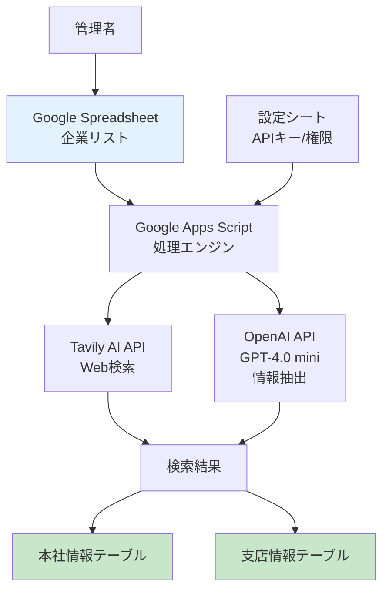

# 企業情報自動収集システム要件定義書

## 文書情報
- 作成日：2024年11月21日
- バージョン：1.0
- 作成者：システム開発チーム

## 1. プロジェクト概要

### 1.1 システム名称
企業情報自動収集システム（Company Information Collection System）

### 1.2 目的
従業員が手作業で行っている企業情報の収集作業を自動化し、業務時間の削減と情報精度の向上を実現する。

### 1.3 背景と課題
- **現状**：従業員が週4-5時間をかけて手作業でWeb検索を行い、企業情報を収集している
- **課題**：
  - 作業時間が膨大（週4-5時間）
  - 異なる企業情報が混ざるリスク
  - 情報の網羅性・正確性の担保が困難

### 1.4 プロジェクトのゴール
- 週4-5時間の作業時間を30分程度に削減（90%以上の削減）
- 企業情報の混在リスクをゼロに
- 営業リスト、顧客管理、BI分析の基盤データとして活用可能な高品質データの提供

## 2. ステークホルダー

### 2.1 利用者（ユーザー）
- **管理者**：システムの実行権限を持つ担当者（限定的なアクセス）
- **データ利用者**：営業部門、マーケティング部門、経営企画部門

### 2.2 システム管理者
- システムの設定・保守を行う技術担当者
- APIキーの管理、エラー対応を実施

### 2.3 その他関係者
- 経営層：投資対効果の評価
- IT部門：技術サポート、セキュリティ管理

## 3. システム要件

### 3.1 機能要件

#### 3.1.1 データ収集機能
| 機能ID | 機能名 | 説明 | 優先度 |
|--------|--------|------|--------|
| F-001 | 企業情報一括取得 | スプレッドシートに記載された100-200社の企業名から本社情報を自動取得 | 高 |
| F-002 | 正式名称自動補正 | 略称や表記揺れを正式企業名に自動変換 | 高 |
| F-003 | 支店情報収集 | 本社情報に紐づく支店・営業所情報を自動収集 | 高 |
| F-004 | バッチ分割処理 | GAS実行時間制限を考慮し、20社ずつのバッチに分割して処理 | 高 |
| F-011 | 本社・支店判別機能 | 取得した情報が本社か支店かを自動判別し、適切なテーブルに振り分け | 高 |

#### 3.1.2 データ管理機能
| 機能ID | 機能名 | 説明 | 優先度 |
|--------|--------|------|--------|
| F-005 | ユニークID生成 | 本社・支店データを結合するための一意のキーを自動生成 | 高 |
| F-006 | データ更新管理 | 既存データの上書き更新（月次更新対応） | 中 |
| F-007 | エラーログ記録 | 処理エラーの詳細をスプレッドシートに記録 | 高 |

#### 3.1.3 通知・レポート機能
| 機能ID | 機能名 | 説明 | 優先度 |
|--------|--------|------|--------|
| F-008 | エラー通知メール | エラー発生時に管理者へメール通知 | 中 |
| F-009 | 処理完了レポート | バッチ処理の実行結果をサマリー表示 | 中 |
| F-010 | 信頼性スコア算出 | 取得情報の信頼度を数値化（情報源、新しさ、複数ソース確認） | 低 |

**信頼性スコアの算出ロジック（100点満点）**

| 評価項目 | 配点 | 評価基準 |
|----------|------|----------|
| **情報源の信頼度** | 40点 | - 公式サイト：40点<br>- 公的機関（官公庁等）：35点<br>- 大手ビジネス情報サイト：30点<br>- ニュースサイト：20点<br>- その他：10点 |
| **情報の新しさ** | 30点 | - 1ヶ月以内：30点<br>- 3ヶ月以内：25点<br>- 6ヶ月以内：20点<br>- 1年以内：15点<br>- 1年超：10点 |
| **複数ソース確認** | 30点 | - 3つ以上で一致：30点<br>- 2つで一致：20点<br>- 1つのみ：10点 |

**スコア判定基準**
- 80点以上：高信頼度（そのまま採用）
- 60-79点：中信頼度（確認推奨）
- 60点未満：低信頼度（要手動確認）

### 3.2 非機能要件

#### 3.2.1 性能要件
| 要件ID | 要件名 | 説明 | 指標 |
|--------|--------|------|------|
| NF-001 | 処理速度 | 200社の処理を完了するまでの時間 | 30分以内 |
| NF-002 | 同時実行制御 | バッチ処理の並列実行を防ぐ | 排他制御実装 |
| NF-003 | リトライ処理 | API呼び出し失敗時の再試行 | 最大3回まで |

#### 3.2.2 セキュリティ要件
| 要件ID | 要件名 | 説明 |
|--------|--------|------|
| NF-004 | アクセス制御 | 管理者のみシステム実行可能 |
| NF-005 | APIキー管理 | APIキーの安全な保管と管理 |
| NF-006 | データアクセス権限 | スプレッドシートの編集権限による制御 |

#### 3.2.3 可用性要件
| 要件ID | 要件名 | 説明 |
|--------|--------|------|
| NF-007 | エラー耐性 | 個別企業のエラーが全体処理を停止させない |
| NF-008 | 処理再開機能 | 中断された処理を途中から再開可能 |

#### 3.2.4 保守性要件
| 要件ID | 要件名 | 説明 |
|--------|--------|------|
| NF-009 | ログ出力 | 処理履歴の詳細ログを保存 |
| NF-010 | 設定の外部化 | APIキー等の設定値を別シートで管理 |

## 4. システム構成

### 4.1 システム構成図



### 4.2 データモデル

**本社情報テーブル**
- 企業ID（主キー）
- 企業名、正式企業名、電話番号、業種（大・中分類）
- 従業員数、設立年、資本金、上場区分
- 本社所在地、代表者名・役職
- 企業理念、最新ニュース、採用状況
- 信頼性スコア、処理日時、処理結果、エラー内容、情報ソースURL

**支店情報テーブル**
- 企業ID（外部キー）
- 支店名、支店電話番号、支店所在地
- 支店種別、主要度ランク

**主要度ランクの定義**
| ランク | 定義 | 例 |
|--------|------|-----|
| 5 | 地域統括拠点・大規模支店 | 関東支社、大阪支店 |
| 4 | 都道府県の主要支店 | 札幌支店、福岡支店 |
| 3 | 中規模支店・営業所 | 千葉営業所、京都支店 |
| 2 | 小規模営業所・出張所 | 〇〇市営業所 |
| 1 | サテライトオフィス・連絡所 | 〇〇出張所 |

**主要度ランクの自動判定ロジック**
| 判定基準 | 判定方法 | ランク |
|----------|----------|--------|
| 名称に「本社」「本店」を含む | テキストマッチング | 対象外（本社テーブル） |
| 名称に「支社」「統括」を含む | テキストマッチング | 5 |
| 政令指定都市・都道府県庁所在地に所在 | 住所判定 | 4 |
| 名称に「支店」を含む＋上記以外の市 | テキスト＋住所判定 | 3 |
| 名称に「営業所」「オフィス」を含む | テキストマッチング | 2 |
| 名称に「出張所」「連絡所」を含む | テキストマッチング | 1 |
| 上記に該当しない | - | 2（デフォルト） |

**実装時の注意事項**
- 複数条件に該当する場合は、より高いランクを採用
- 海外拠点は国名を含む場合はランク4として扱う
- 判定が困難な場合は、Web検索結果から従業員数や拠点規模の情報を参考に判定

**本社・支店判別ロジック**

| 判別対象 | 本社として判定する条件 | 支店として判定する条件 |
|----------|------------------------|------------------------|
| 名称 | ・「本社」「本店」「本部」を含む<br>・「Head Office」「HQ」を含む<br>・企業名のみ（支店名なし） | ・「支社」「支店」「営業所」を含む<br>・「Branch」「Office」を含む<br>・地域名＋拠点種別の組み合わせ |
| 住所 | ・登記上の本店所在地と一致<br>・資本金情報と紐づく住所 | ・本社所在地と異なる住所<br>・複数存在する同一企業の拠点 |
| 電話番号 | ・代表電話番号<br>・0120/0570等の統一番号 | ・地域別の市外局番<br>・本社と異なる番号 |

**データ振り分けフロー**
```
1. 企業情報を検索・取得
2. 本社判定条件をチェック
   → 該当する場合：本社テーブルへ
   → 該当しない場合：次のステップへ
3. 支店判定条件をチェック
   → 該当する場合：支店テーブルへ
   → 該当しない場合：ログに記録し手動確認
4. 重複チェック
   → 本社テーブルに既存：支店として再判定
   → 支店テーブルに本社情報がある：本社テーブルへ移動
```

**処理状態管理テーブル**
- バッチ番号、処理状態、開始/終了時刻
- 処理件数、エラー件数

## 5. 制約条件

### 5.1 技術的制約
- Google Apps Scriptの実行時間制限（6分/実行）
- 使用技術：Google Spreadsheet、Google Apps Script、Tavily AI API、OpenAI API（GPT-4.0 mini）

### 5.2 予算的制約
- 月間APIコスト：約630円（200社処理時）
  - Tavily AI：約600円
  - OpenAI：約30円

### 5.3 時間的制約
- 初期開発期間：要相談
- 月次処理：手動実行（30分程度）

## 6. 前提条件
- Google Workspaceの利用環境が整備されていること
- Tavily AI APIとOpenAI APIのアカウント取得済みであること
- 処理対象企業のリストが事前に準備されていること

## 7. リスク

| リスクID | リスク内容 | 影響度 | 対応策 |
|----------|------------|--------|--------|
| R-001 | API サービスの停止 | 高 | 手動処理への切り替え手順を準備 |
| R-002 | API料金の値上げ | 中 | 定期的な料金確認と予算見直し |
| R-003 | 取得情報の不正確性 | 中 | 信頼性スコアによる品質管理 |
| R-004 | 処理時間の超過 | 低 | バッチサイズの調整機能 |

## 8. 将来的な拡張性
- 企業の財務情報の自動取得
- 競合分析機能の追加
- リアルタイムでの情報更新（Webhook連携）
- 他システムとのAPI連携
- AI による企業分析レポートの自動生成

## 9. 用語集

| 用語 | 説明 |
|------|------|
| GAS | Google Apps Scriptの略称 |
| バッチ処理 | 複数のデータをまとめて処理する方式 |
| API | Application Programming Interface |
| 信頼性スコア | 情報源の信頼度、新しさ、複数ソース確認に基づく評価値 |
| 正規化 | データの表記を統一された形式に変換すること |

## 10. 承認

| 役割 | 氏名 | 日付 | 署名 |
|------|------|------|------|
| プロジェクトオーナー | 【氏名】 | 【日付】 | 【署名】 |
| システム管理者 | 【氏名】 | 【日付】 | 【署名】 |
| 開発責任者 | 【氏名】 | 【日付】 | 【署名】 |