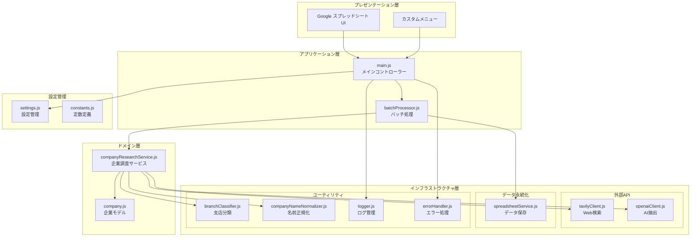
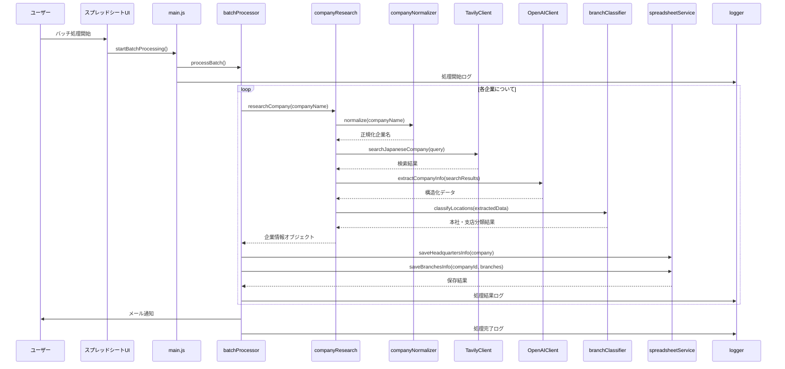
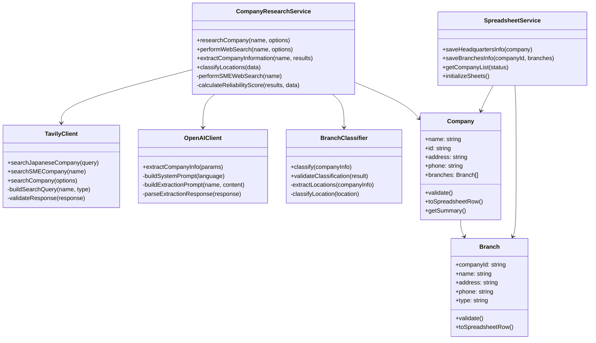
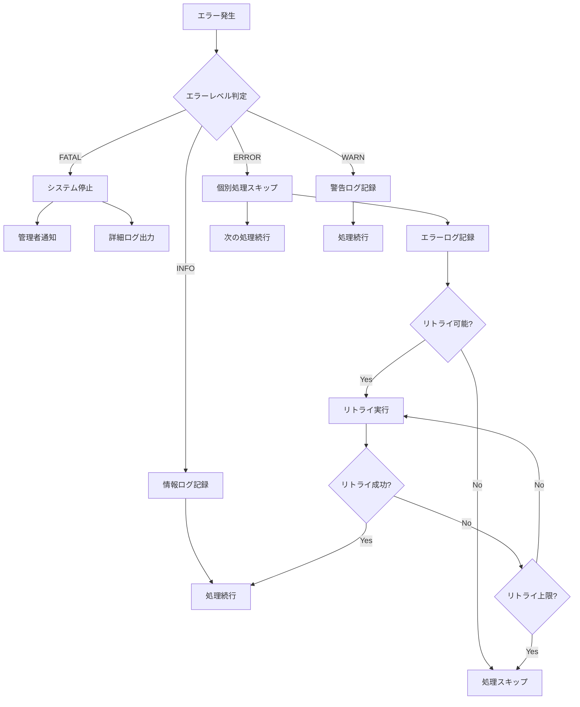

# システムアーキテクチャ設計書

## アーキテクチャ概要

このシステムは、Google Apps Script（GAS）をベースとした企業情報自動収集システムです。レイヤードアーキテクチャを採用し、各層の責務を明確に分離することで、保守性と拡張性を確保しています。

## システム構成図

## データフロー詳細

## 各層の責務

### 1. プレゼンテーション層
- **Google スプレッドシート UI**: ユーザーインターフェース
- **カスタムメニュー**: システム操作のエントリーポイント

**主な責務:**
- ユーザー操作の受付
- 処理結果の表示
- 設定画面の提供

### 2. アプリケーション層
- **main.js**: メインコントローラー、UI制御
- **batchProcessor.js**: バッチ処理のオーケストレーション

**主な責務:**
- ユースケースの実行制御
- 処理フローの管理
- エラーハンドリング
- ログ出力

### 3. ドメイン層
- **companyResearchService.js**: 企業調査のコアロジック
- **company.js**: 企業・支店データモデル

**主な責務:**
- ビジネスロジックの実装
- ドメインルールの適用
- データ変換・検証

### 4. インフラストラクチャ層

#### 4.1 外部API層
- **tavilyClient.js**: Tavily AI APIとの通信
- **openaiClient.js**: OpenAI APIとの通信

**主な責務:**
- 外部APIへのリクエスト
- レスポンスの変換
- エラーハンドリング
- レート制限対応

#### 4.2 データ永続化層
- **spreadsheetService.js**: Google スプレッドシートとの連携

**主な責務:**
- データの永続化
- CRUD操作
- データフォーマット変換

#### 4.3 ユーティリティ層
- **branchClassifier.js**: 支店分類ロジック
- **companyNameNormalizer.js**: 企業名正規化
- **logger.js**: ログ管理
- **errorHandler.js**: エラー処理

**主な責務:**
- 横断的関心事の処理
- 共通機能の提供
- ユーティリティ機能

### 5. 設定管理層
- **settings.js**: 設定値管理
- **constants.js**: 定数定義

**主な責務:**
- 設定値の管理
- 環境設定の抽象化

## クラス設計

### 主要クラスの関係図

## エラーハンドリング戦略

### エラーレベル定義
1. **FATAL**: システム全体の停止を要するエラー
2. **ERROR**: 個別処理の失敗（処理継続可能）
3. **WARN**: 警告レベル（処理継続、要注意）
4. **INFO**: 情報レベル（正常処理の記録）

### エラー処理フロー

## セキュリティ設計

### 1. APIキー管理
- Google Apps ScriptのPropertiesServiceを使用
- 暗号化された状態でスクリプトプロパティに保存
- アクセス制御による保護

### 2. アクセス制御
- スプレッドシートの共有設定による制御
- 実行権限の制限
- 機能別のアクセス制御

### 3. データ保護
- 個人情報の最小化
- ログ情報の暗号化
- データの定期的な削除

## パフォーマンス設計

### 1. 処理時間最適化
- バッチサイズの動的調整
- API呼び出しの並列化
- キャッシュの活用

### 2. リソース管理
- メモリ使用量の監視
- API制限の管理
- 処理時間の制限対応

### 3. 監視・メトリクス
- 処理時間の測定
- エラー率の監視
- API使用量の追跡

## 拡張性設計

### 1. プラグイン機能
- 新しい情報源の追加
- 処理ロジックの拡張
- 出力形式の追加

### 2. API連携
- 外部システムとの連携
- Webhook対応
- RESTful API提供

### 3. データ形式対応
- 新しいスキーマ対応
- データ変換機能
- バージョン管理

## デプロイメント戦略

### 1. 環境分離
- 開発環境
- テスト環境
- 本番環境

### 2. デプロイメントプロセス
1. ローカル開発（clasp）
2. テスト実行
3. ステージング環境デプロイ
4. 本番環境デプロイ
5. 動作確認

### 3. ロールバック戦略
- バージョン管理
- 設定のバックアップ
- データの復旧手順

## 監視・ログ戦略

### 1. ログレベル
- DEBUG: 詳細なデバッグ情報
- INFO: 一般的な情報
- WARN: 警告レベル
- ERROR: エラー情報
- FATAL: 致命的エラー

### 2. ログ出力先
- Google スプレッドシート（ログシート）
- コンソールログ
- メール通知

### 3. 監視項目
- 処理成功率
- 処理時間
- API使用量
- エラー発生頻度
- データ品質指標

## 今後の技術的改善

### 短期（3ヶ月）
- ユニットテストの充実
- パフォーマンス最適化
- エラーハンドリングの改善

### 中期（6ヶ月）
- マイクロサービス化
- 非同期処理の導入
- 機械学習モデルの組み込み

### 長期（1年）
- クラウドネイティブ化
- リアルタイム処理対応
- AI分析機能の強化